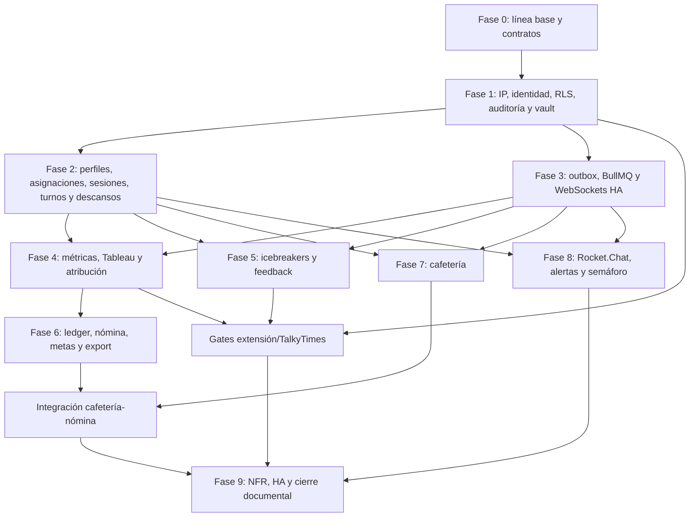

# Plan de remediación del backend contra Agency OS v2.2

**Fecha de la auditoría:** 2026-08-13  
**Alcance:** backend NestJS/Fastify, PostgreSQL, Redis, workers e integraciones que el backend debe exponer o consumir.  
**Fuera de alcance de implementación de este plan:** UI web, código final de la extensión/helper, administración del VPS de Rocket.Chat y el motor FastAPI de IA. Sí se incluyen sus contratos, pruebas de integración y gates porque el backend no puede declarar completos los FR que dependen de ellos.

## 1. Objetivo y fuentes de verdad

El objetivo es llevar la implementación desde “existen módulos, tablas y endpoints” hasta “cada requisito aplicable al backend está protegido, integrado, observable y probado”. El orden de precedencia usado es:

1. [`agency-os-requerimientos.md`](../../FREELANCE/AGENCIA%20CAROL/documentos/agency-os-requerimientos.md), versión 2.2 del 2026-08-04: fuente funcional vigente.
2. [`agents.md`](../agents.md): decisiones posteriores y aclaraciones operativas, en particular scrypt, turnos 06:05/14:05/22:05, ETL diario, reparto 5/55 y flujo del vault.
3. [`backend/PLAN.md`](../backend/PLAN.md): diseño técnico previsto.
4. [`CLAUDE.md`](../CLAUDE.md): guía operativa del repositorio; no puede prevalecer sobre los tres documentos anteriores.
5. Código, migraciones y pruebas bajo [`backend/`](../backend/): evidencia de lo realmente implementado.

Si un texto de `backend/PLAN.md` ya no coincide con v2.2 o `agents.md`, la corrección debe actualizar código **y** documentación; no se debe adaptar el requerimiento al código existente.

## 2. Foto verificable del estado actual

Esta foto es una línea base, no un criterio de finalización:

- La suite unitaria ejecutada durante la auditoría pasó 89/89 y el lint propio del backend pasó.
- El build/typecheck local quedó bloqueado porque `@nestjs/swagger` está declarado pero no presente en la instalación local.
- `pnpm lint` en la raíz falla porque `packages/shared` declara `eslint` sin tener una configuración/dependencia reproducible.
- La suite de integración no se pudo reejecutar porque Docker no estaba activo. La existencia de pruebas de integración en `backend/src/test/integration/` no prueba que hoy pasen.
- Hay dos workflows (`.github/workflows/ci.yml` y `backend.yml`) con gates diferentes. El segundo sí levanta PostgreSQL/Redis; el primero puede fallar antes por el lint raíz y no ejecuta la misma batería.
- La implementación cubre una parte importante del esquema, pero los riesgos críticos están en la ejecución: token de dispositivo sin validar, guardia de turno ausente, RLS potencialmente eludida por el propietario, rutas públicas fuera del filtro IP, bitácora sin escritor, outbox sin consumidor y cálculos incompletos.

## 3. Convenciones de trazabilidad

### 3.1 Estados

- **Parcial:** existe una base útil, pero falta al menos un criterio del requerimiento.
- **No cumple:** el flujo efectivo no satisface el requisito aunque exista esquema preparatorio.
- **Gate externo:** no puede cerrarse sin evidencia de TalkyTimes, Tableau, extensión/helper o Rocket.Chat.
- **Descartado:** el propio documento vigente lo retiró del alcance.

### 3.2 Prioridades

- **P0:** permite acceso indebido, exposición de secretos, cálculo monetario incorrecto o invalida la defensa en profundidad.
- **P1:** bloquea un flujo funcional o un hito de entrega.
- **P2:** deuda de robustez, rendimiento, mantenibilidad o experiencia operativa.

### 3.3 Definition of Done por requisito

Un FR solo pasa a **Cumple** cuando se verifican todos estos puntos:

1. Contrato de entrada/salida tipado y validado, con errores estables y accionables.
2. Autenticación, permiso, alcance por cuadrilla/usuario, IP, dispositivo y turno aplicados según la matriz de acceso.
3. Invariantes críticas respaldadas por la base de datos, no solo por un `if` del servicio.
4. Efectos laterales durables e idempotentes; sin `fire-and-forget` en el proceso HTTP.
5. Auditoría obligatoria sin secretos y métricas operativas suficientes para detectar fallos.
6. Pruebas unitarias, integración real PostgreSQL/Redis, contrato HTTP y casos de abuso.
7. Paginación/límites en colecciones y prueba de rendimiento cuando exista un NFR de latencia.
8. Documentación de operación, rollback y recuperación si el cambio afecta migraciones, jobs o integraciones.

## 4. Threat model mínimo que gobierna la corrección

| Frontera | Activo | Abuso que debe probarse primero | Control esperado |
|---|---|---|---|
| Internet/LB → Fastify | Toda la API | Falsificar `X-Forwarded-For`; entrar por login/refresh/enroll desde IP no autorizada | `trustProxy` restringido al LB, normalización de IP, allowlist fail-closed y excepción exclusiva de salud |
| Web/extension → API | JWT, refresh y token de dispositivo | Token expirado/revocado, token de otro operador, refresh reutilizado o carrera de rotación | Principal de dispositivo validado, binding usuario-dispositivo y rotación atómica |
| Extensión → vault | Credenciales TalkyTimes | Pedir credencial fuera de turno/asignación, quemar grant ajeno, repetir redeem, registrar el secreto | Seis validaciones previas, grant ligado a usuario/dispositivo/sesión, consumo atómico y bitácora sanitizada |
| API → PostgreSQL | Filas de operadores, nómina, vault | Operador cruza cuadrilla; coordinador ve otra cuadrilla; rol de conexión evita RLS | Rol de runtime sin `BYPASSRLS` ni propiedad, RLS forzada/probada y políticas por operación |
| API → Redis/workers | Grants, colas, sockets | Job duplicado, perdido al reiniciar o procesado por dos instancias | IDs deterministas, reintentos acotados, leases, DLQ y outbox transaccional |
| Worker → Tableau/IA/Rocket.Chat | Tokens externos y datos no confiables | SSRF, CSV malformado, respuesta IA que evade reglas, envío duplicado | Destinos allowlisted, timeouts/tamaño, parser estricto, regla local autoritativa e idempotencia |
| Cafetería/nómina | Dinero y descuentos | Doble entrega/débito, ajuste sobre periodo cerrado, operador ve tarifa bruta | CAS + índice único, ledger inmutable/reversas, cierre protegido y DTO por audiencia |

## 5. Verificación requisito por requisito

### 5.1 FR-01 a FR-05 — autenticación y control de acceso

| FR | Estado / prioridad | Evidencia actual | Brecha concreta | Corrección y criterio de aceptación | Tareas |
|---|---|---|---|---|---|
| **FR-01** Login, JWT corto, refresh y scrypt | Parcial / P0 | `auth.controller.ts`, `auth.service.ts` y `crypto.ts` implementan login, refresh y scrypt asíncrono. | La rotación de refresh puede sufrir carrera; faltan pruebas de reutilización concurrente, política completa de cookie, rate limits por identidad/IP y confirmación de rehash al subir `log2N`. La ruta pública evade hoy IP. | Un solo refresh gana mediante update condicional/lock; la reutilización revoca la familia; cookies `HttpOnly`, `Secure`, `SameSite` y path explícitos; login no revela existencia; scrypt conserva parámetros y rehash en login; pruebas de ocho logins concurrentes y presión de memoria. | SEC-03, SEC-04, QUA-02 |
| **FR-02** RBAC y RLS | Parcial crítico / P0 | Roles/permisos y `PermissionsGuard` existen; migración 0002 activa RLS en seis tablas. | `DIRECTOR_OPERATIVO` recibe todos los permisos de ADMIN sin matriz aprobada; muchas rutas no declaran permiso; coordinador no tiene alcance de cuadrilla consistente; la conexión `agency` parece propietaria y puede eludir RLS; solo seis tablas están cubiertas. | Matriz ruta×rol aprobada, denegación por defecto, filtros de cuadrilla en servicio y RLS, runtime con rol no propietario, pruebas cruzadas para ADMIN/DIRECTOR/COORDINADOR/OPERADOR/CAFETERIA/JOB. Ningún controlador sensible queda sin política explícita. | FND-04, SEC-01, SEC-02 |
| **FR-03** Restricción por IP | No cumple en rutas públicas / P0 | `IpAllowlistGuard` consulta CIDR y scopes. | `@Public()` omite por completo el guard, por lo que login, refresh y enroll quedan abiertos; si no hay filas activas el guard permite; no hay configuración segura de proxies confiables. | Solo `/health/live` y `/health/ready` quedan fuera. Producción falla cerrado si no hay allowlist. `request.ip` solo acepta cabeceras reenviadas desde CIDR del balanceador. Pruebas con `X-Forwarded-For` falsificado, IPv4-mapped IPv6, CIDR expirado y scopes. | SEC-03 |
| **FR-04** Operador solo en turno y horas extra | Parcial / P0 | `ShiftAccessService`, `ShiftWindowGuard`, checks de login/refresh, rangos `[)` y overrides revocables; materialización desde plantillas, cierre automático, relevo contiguo y CAS de sesiones en `backend/src/modules/jobs/jobs.service.ts` y `backend/src/modules/assignments/assignments.service.ts`; pruebas unitarias e integración PostgreSQL en `backend/src/test/integration/shift-access.int.spec.ts`, `backend/src/test/integration/shifts-and-crews.int.spec.ts` y `backend/src/test/integration/assignments.int.spec.ts`. | La ventana, el relevo y la concurrencia de heartbeat ya tienen base verificable, pero faltan proyección tiempo-real completa, overrides sobre turnos materializados y resolver el alcance RBAC/RLS condicionado por SEC-02. | Operador no obtiene ni renueva sesión fuera de un `shift`/override válido; toda acción operativa revalida la ventana; ADMIN/DIRECTOR/COORDINADOR/CAFETERIA usan reglas explícitas. Bordes semiabiertos `[)`, horarios 06:05/14:05/22:05, jornada nocturna, cierre idempotente, CAS y relevo 5/55 preparado por rangos probados. | SEC-06, OPS-02, OPS-03, OPS-05 |
| **FR-05** Auditoría inmutable | No cumple / P0 | Tabla `audit_log`, check de claves secretas y lector administrativo existen. | No hay inserciones productivas; las revocaciones dependen de que exista `agency_app`; no hay partición/retención, catálogo de eventos ni garantía de registrar intentos denegados. | Escritor central transaccional registra acceso/denegación vault, comisión, asignación, publicación/revisión, seguridad y acciones administrativas; actor/IP/request/device/result presentes; solo rol de auditoría lee; nadie actualiza/borra; partición mensual y prueba de secreto prohibido. | SEC-07, SEC-08 |

### 5.2 FR-06 a FR-09 — perfiles y vault

| FR | Estado / prioridad | Evidencia actual | Brecha concreta | Corrección y criterio de aceptación | Tareas |
|---|---|---|---|---|---|
| **FR-06** CRUD de perfiles TalkyTimes | Parcial / P1 | `profiles.controller/service/schemas` ofrecen listar, crear, leer, editar y desactivar. | Falta probar permisos por rol/cuadrilla, auditoría de cambios, concurrencia de actualización y paginación uniforme del historial. | CRUD idempotente, sin borrado físico, con versión/ETag o update condicional; username normalizado/único; acceso y mutaciones auditados; coordinador solo sobre su alcance; pruebas 404-vs-403 sin filtrar existencia. | OPS-01 |
| **FR-07** Vault AES-256 y secreto solo a la extensión | Parcial crítico / P0 | Cifrado AES-GCM, credencial versionada y grant/redeem de 60 s existen. | `DeviceTokenGuard` solo verifica que el header exista; no se exige turno; expiración del dispositivo se ignora; redeem hace `GETDEL` antes de validar binding y permite quemar un grant conocido; versión de clave efectiva fija y falta rotación operativa. | Token de dispositivo validado; seis precondiciones de `PLAN.md`; grant ligado a usuario/dispositivo/perfil/sesión y consumido atómicamente solo si coincide; un uso; secreto únicamente en respuesta HTTPS del redeem; cero persistencia/log; rotación de clave ensayada y acceso a columnas restringido. | SEC-05, SEC-09, SEC-10, INT-01 |
| **FR-08** Asignación por turno sin sesiones simultáneas | Parcial / P0 | Exclusion constraint de rangos y unique parcial para sesión viva; `AssignmentsService` cierra la asignación/sesión saliente en `end()` y en relevo contiguo; el reaper cubre expiración de asignación y heartbeat; `profile_sessions.version` evita sobrescrituras de heartbeats concurrentes. | Falta prueba dedicada de carreras multi-instancia y límite configurable de perfiles por operador. | Crear/relevar asignación es transaccional; al borde exacto termina la sesión saliente antes de admitir la entrante, con gracia 0; estados viejos se cierran o quedan `STALE` terminales; conflictos devuelven 409 accionable; invariantes sobreviven carreras. | OPS-02, OPS-03 |
| **FR-09** Historial operador/perfil/horario/puntos | Parcial / P1 | `profile_assignments`, `profile_sessions` y `points_ledger` existen. | El ETL/ingesta no llena de manera completa el ledger ni vincula cada punto con la asignación; no hay lectura histórica integrada. | Cada fila de puntos tiene fuente, timestamp, assignment y operator; el historial combina rangos, sesiones y puntos sin inferir por hora de ingesta; paginado y scoped; correcciones son reversas, no updates destructivos. | OPS-02, MET-05, PAY-01 |

### 5.3 FR-10 a FR-14 — extensión y sesiones

| FR | Estado / prioridad | Evidencia actual | Brecha concreta | Corrección y criterio de aceptación | Tareas |
|---|---|---|---|---|---|
| **FR-10** Panel de perfiles y estado | Parcial / P1 | `GET /agent/profiles/assigned` devuelve asignaciones y la última sesión no cerrada de la asignación vigente con `sessionId`, `version`, estado `STALE` y error seguro; web reabre `ERROR/STALE`. | Falta push en tiempo real, última señal explícita y razón/telemetría accionable completa. | Read model por perfil con estado derivado, `sessionId`, última señal, código de error seguro y acción sugerida; snapshot HTTP + eventos WS monotónicos; solo asignaciones vigentes. | OPS-04, ASY-03 |
| **FR-11** Extensión obtiene e inyecta credencial | Backend parcial + gate externo / P0 | El flujo actual usa `chrome.storage.managed` para configuración, Native Messaging sin secretos y grant/redeem de un solo uso; el chequeo estático de la extensión está automatizado. | No existe prueba E2E extensión-background → API → DOM real con token de dispositivo en una PC administrada. El `credenciales.json` pertenece únicamente al spike histórico y no está en el flujo actual. | Prueba en PC de test demuestra credencial solicitada justo al login, relleno por setter/eventos, clic humano, cero `chrome.storage`/archivo/log para el secreto y revocación efectiva. El backend entrega una sola vez y audita metadatos. | SEC-09, INT-01 |
| **FR-12** Perfiles nativos Chrome aislados | Backend parcial + gate externo / P1 | `tt_profiles.chrome_profile_dir` es autoritativo; crear sesión exige coincidencia exacta, vault/reclamación revalidan el binding y el perfil no puede cambiarlo con sesión viva. | Falta validar físicamente en cada estación que la carpeta lógica corresponde al perfil correcto y demostrar cookies aisladas con hasta ocho perfiles. | Mapping administrado perfil TT↔perfil Chrome, rechazo de binding incoherente y evidencia de cookies aisladas con hasta ocho perfiles. El backend sigue operativo si Chrome continúa y la API cae. | OPS-03, INT-01 |
| **FR-13** Detección automática de caída | Descartado | v2.2 lo marca fuera de alcance. | Ninguna. | No crear polling o automatización encubierta. Conservar solo estado manual/heartbeat ya requerido por FR-10/15. | — |
| **FR-14** Captura y persistencia de métricas | Parcial crítico / P0 | `POST /agent/metrics/batch` inserta `metric_events` con deduplicación básica. | Cualquier string pasa como token de dispositivo; no se comprueba que evento, sesión, perfil, operador y dispositivo correspondan; no hay límites por lote/evento, semántica de contadores ni agregación durable. | Principal de dispositivo verificado; lote acotado; todos los eventos pertenecen a la sesión asignada; timestamps dentro de tolerancia; idempotencia por evento; rechazo atómico o política explícita de parciales; agregados reproducibles y pruebas de replay/falsificación. | SEC-05, MET-01, MET-02, INT-01 |

### 5.4 FR-15 a FR-17 — turnos y tiempo efectivo

| FR | Estado / prioridad | Evidencia actual | Brecha concreta | Corrección y criterio de aceptación | Tareas |
|---|---|---|---|---|---|
| **FR-15** Inicio/fin automático del turno | Parcial / P1 | Hay endpoints y job de cierre de shifts; el job de reaper cierra sesiones al expirar asignaciones, marca `STALE` el heartbeat vencido y el relevo contiguo cierra la sesión saliente en la misma transacción. | El inicio/fin aún no está integrado con una proyección completa de sesión/turno; falta reaper durable/leases, liquidación completa de tiempo e idempotencia probada bajo dos instancias. | Primera sesión válida abre el turno una vez; última/finalización programada lo cierra y liquida tiempo; heartbeat no sustituye el fin de asignación; reintentos no duplican eventos. | OPS-03, OPS-05, INT-01 |
| **FR-16** Descansos y aviso anticipado | Parcial / P1 | Módulo `breaks` permite listar/iniciar/finalizar. | No genera descansos desde plantilla, no agenda aviso, no actualiza semáforo/WS ni aplica solapamiento/estado con rigor. | Descansos preasignados, un activo máximo, dentro del turno, aviso durable configurable, inicio/fin idempotentes, cierre automático al terminar turno y proyección inmediata. La regla de límite de mensajes de TalkyTimes queda como decisión de negocio explícita. | OPS-06, ASY-01, ASY-03 |
| **FR-17** Reporte de tiempo efectivo | Parcial / P1 | `GET /reports/effective-time` lee shifts. | El cálculo no descuenta correctamente descansos/segmentos de sesión ni trata turnos incompletos, overrides o cruces de día; falta alcance de cuadrilla. | Fórmula documentada: intersección turno aprobado∩sesiones válidas menos descansos; minutos enteros deterministas; totales por operador/periodo; ADMIN/DIRECTOR todo, coordinador cuadrilla; export/consulta paginada y casos DST/zona Bogotá. | OPS-07 |

### 5.5 FR-18 a FR-20 — métricas y Tableau

| FR | Estado / prioridad | Evidencia actual | Brecha concreta | Corrección y criterio de aceptación | Tareas |
|---|---|---|---|---|---|
| **FR-18** Dashboard de perfil | Parcial / P1 | Endpoints de perfiles, ranking y timeseries; tabla `profile_daily_metrics`. | Los agregados no se alimentan; filtros/ranking son incompletos; no hay prueba <3 s ni datos de respuesta/icebreaker integrados. | Agregador idempotente produce puntos, interacciones, tasa de respuesta, ranking y tendencia; filtros por rango/cuadrilla/perfil; consulta p95 <3 s con volumen objetivo e índices explicados. | MET-02, MET-07, QUA-02 |
| **FR-19** Sincronización Tableau y caché local | Parcial / P1 | El discovery real confirmó PAT/API `3.29`, 18 workbooks, 86 vistas y Revenue detailed (`viewId` `0886ff29-117e-4e3f-b11a-6dafde449803`). | La vista principal exporta un resumen de 1.528 filas sin fecha/hora; al expandir `ID Trusted User` la UI muestra más detalle, pero REST/crosstab no lo exponen. La vista hermana `Revenue detailed (SourceID)` exporta 1.539 filas semanales (`Date aggregated`) con `Max Hour=20` constante. El código sigue con ejecución `void`, parser simplista, sin artefacto, timezone, reconciliación, reintento ni promoción atómica. | ETL por vista con artefacto/checksum, contrato versionado, staging, promoción transaccional, reproceso exacto y dashboard local. Ambas vistas quedan catalogadas como resumen; puntos/revenue atribuible requieren una worksheet plana con una fila por perfil/SourceID/hora. | MET-03, MET-04, MET-05, MET-06, ASY-01 |
| **FR-20** Visibilidad por rol y competiciones | No cumple completamente / P0 | Hay permisos y endpoints de métricas/competencias. | Operador puede quedar sin endpoint propio o recibir DTO incorrecto; coordinador no se limita siempre a cuadrilla; ranking ignora alcance; RLS no cubre todas las proyecciones. | DTO y query por audiencia: ADMIN/DIRECTOR según matriz, coordinador solo sus crew IDs, operador solo sus asignaciones/datos propios; competencia respeta participantes y fechas; pruebas de no inferencia por IDs. | SEC-02, MET-07, PAY-02 |

### 5.6 FR-21 a FR-27 — icebreakers

| FR | Estado / prioridad | Evidencia actual | Brecha concreta | Corrección y criterio de aceptación | Tareas |
|---|---|---|---|---|---|
| **FR-21** Crear, asociar, notificar y revisar | Parcial / P1 | CRUD/evaluate/publish/reviews y tablas básicas existen. | No se garantiza que el perfil esté asignado al autor; falta notificación automática de prohibido; revisión no valida jerarquía/cuadrilla; flujo de aprobación sigue abierto; Feature #9 no ejecutado. | Perfil obligatorio y asignado; bloqueo crea violación + outbox al superior correcto; solo superior autorizado adjudica; estados/transiciones explícitos; publicación auditada. La verificación de chat se activa solo tras gate. | ICE-01, ICE-04, INT-02 |
| **FR-22** LLM + regex, regla exacta bloqueante | No cumple de forma segura / P0 | Cliente IA y reglas regex/fallback local existen. | Si la IA remota responde, puede saltarse el bloqueo local; regex corre sin defensa contra ReDoS; el contrato no garantiza código/regla exacta. | Motor local determinista se ejecuta siempre y tiene precedencia; patrones validados/limitados o motor seguro; timeout/circuit breaker IA; cualquier salida IA se valida; respuesta bloqueada incluye `ruleId`, nombre y mensaje accionable sin exponer prompt. | ICE-02 |
| **FR-23** Score multidimensional 0–100 | No cumple / P1 | Existe un score normalizado genérico. | Faltan originalidad, engagement, tono y CTA en escala 0–100 y versión del modelo/rúbrica. | Evaluación inmutable guarda cuatro dimensiones, total derivado, rúbrica/model version y raw seguro; schema rechaza fuera de rango/inconsistente. | ICE-01, ICE-03 |
| **FR-24** Tips y reevaluación ilimitada | Parcial / P1 | Se puede editar y reevaluar. | No hay contrato fuerte de tips ni historial inequívoco de intentos/versiones; concurrencia puede publicar/evaluar texto distinto. | Cada edición crea versión o hash de texto; cada evaluación referencia esa versión y contiene tips accionables; reevaluaciones no sobrescriben; publish usa exactamente la versión aprobada. | ICE-03 |
| **FR-25** Trazabilidad de bloqueos | Parcial / P1 | `icebreaker_violations` existe y hay consulta administrativa. | No todos los bloqueos insertan; faltan snapshot/hash, evaluación/regla/versiones y alcance de cuadrilla; sin audit/outbox garantizado. | Todo bloqueo genera fila inmutable con operador, perfil, fecha, regla, versión y texto sanitizado/hash según política; consulta paginada/scoped; auditoría y notificación en la misma transacción lógica. | ICE-01, ICE-04, ICE-05 |
| **FR-26** Feedback score vs respuesta real | No cumple / P1 | Tabla de efectividad básica. | Grano y jobs no conectan icebreaker publicado con métricas reales ni producen calibración. | Join determinista publicación→envío→respuesta, ventana temporal versionada, cobertura/calidad reportada; job diario idempotente; dataset de calibración no cambia scores históricos. | ICE-05, ICE-06 |
| **FR-27** Historial por perfil | Parcial / P1 | Hay lecturas de evaluaciones/efectividad. | No existe proyección por perfil que una texto/versiones, score, publicación y respuesta real con alcance/paginación. | Endpoint por perfil devuelve línea temporal paginada y autorizada; distingue no enviado/sin respuesta/dato no disponible; métricas enlazadas a la versión publicada. | ICE-05 |

### 5.7 FR-28 a FR-31 — nómina

| FR | Estado / prioridad | Evidencia actual | Brecha concreta | Corrección y criterio de aceptación | Tareas |
|---|---|---|---|---|---|
| **FR-28** Puntos y COP mensual sin revelar bruto/tarifa | No cumple completamente / P0 | `GET /payroll/me/summary` y cálculo de líneas existen. | El DTO actual incluye `grossCop`; el ledger no está alimentado de punta a punta; “tiempo real” y visibilidad no están separados por audiencia. | Endpoint del operador devuelve solo magnitudes autorizadas y su neto/progreso, nunca comisión individual ni valor al 100%; endpoint administrativo separado. Totales se derivan del ledger, con latencia/frescura explícita. Prueba snapshot de campos prohibidos. | PAY-03, PAY-04 |
| **FR-29** Conversión, comisión, días y eventos | Parcial / P0 | Compensación versionada y competencias tienen esquema/endpoints. | Compute toma compensación vigente “ahora”, no la aplicable al evento/turno; no calcula días trabajados ni efectos de eventos; ajustes carecen de integración completa. | Cada tramo usa compensación efectiva en su fecha; días derivan de turnos válidos; competencias/eventos tienen reglas/versiones y ledger; cambios auditados; jamás se reescribe historia cerrada. | PAY-01, PAY-02, PAY-03 |
| **FR-30** Metas, bonos y progreso | Parcial / P1 | CRUD de goals y progreso básico. | Bonos/tier/scope no se liquidan ni quedan congelados al cierre; reglas incompletas. | Meta versionada por periodo/usuario/cuadrilla, progreso reproducible, bono determinista en ledger/línea y snapshot al lock; operador ve progreso sin tarifas. | PAY-02, PAY-03 |
| **FR-31** Exportación XLSX | No cumple / P1 | Tabla `payroll_exports` sin flujo de generación. | No hay job, archivo, checksum, almacenamiento ni descarga autorizada. | Export job toma periodo bloqueado, genera XLSX con puntos, neto, cafetería, ajustes y final; checksum/estado/expiración; objeto privado + URL firmada corta; reintento idempotente y prueba del contenido del workbook. | PAY-05 |

### 5.8 FR-32 a FR-35 — cafetería

| FR | Estado / prioridad | Evidencia actual | Brecha concreta | Corrección y criterio de aceptación | Tareas |
|---|---|---|---|---|---|
| **FR-32** Productos | Parcial avanzado / P1 | CRUD parcial de productos/menu, precio y disponibilidad. | Falta auditoría, paginación administrativa, política de cambio de precio frente a órdenes y permisos revisados. | Producto se desactiva, no borra; orden guarda snapshot de nombre/precio; SKU único; cambios auditados; menú solo devuelve disponibles. | CAF-01 |
| **FR-33** Pedidos web/extensión | Parcial / P1 | `POST /cafeteria/orders` con idempotency key y tablas de items. | Precheck+insert puede correr en carrera; consulta producto por item; no aplica turno/dispositivo a canal extensión ni contrato compartido. | Una transacción calcula todos los items con query acotada, usa unique como autoridad y devuelve la misma orden ante replay; canal/origen registrado; operador/turno válidos; contrato compartido web/extensión. | CAF-01, SEC-06 |
| **FR-34** KDS tiempo real, entrega y tiempo máximo | Parcial / P1 | Listado y cambio de estados; job expira órdenes. | No hay WebSocket; transición no usa compare-and-set; deadline parece global/hardcoded; falta SLA <500 ms y manejo consistente de expiración/cancelación. | Máquina de estados con CAS, `pickupDeadlineAt` congelado, eventos outbox/WS, KDS scoped al rol CAFETERIA, p95 <500 ms; dos entregas concurrentes producen una sola transición/débito. | CAF-02, CAF-03, ASY-03 |
| **FR-35** Descuento de nómina | Parcial / P0 | Entrega crea `operator_account_entries` con unique por referencia. | Nómina no suma el consumo; reversas/cancelaciones y periodos cerrados no están resueltos de extremo a extremo. | DELIVERED crea un débito exactamente una vez; corrección crea reversa enlazada; compute suma entradas del periodo; periodo cerrado rechaza mutaciones; conciliación orden↔ledger↔nómina cuadra a cero. | CAF-03, CAF-04, PAY-03 |

### 5.9 FR-36 a FR-39 — comunicación e interacciones

| FR | Estado / prioridad | Evidencia actual | Brecha concreta | Corrección y criterio de aceptación | Tareas |
|---|---|---|---|---|---|
| **FR-36** Canales Rocket.Chat por cuadrilla | Parcial / P1 | Tablas/endpoints de canales; Rocket.Chat self-hosted ya fue validado aparte. | No hay reconciliación backend↔Rocket.Chat, membresía por cambios de crew, secretos/API client ni manejo de drift. | Worker idempotente crea/vincula canal, sincroniza miembros y registra external ID; cambios de cuadrilla generan outbox; drift reportado y reparable; credenciales fuera de BD/logs de negocio. | COM-01, ASY-02 |
| **FR-37** Mensajes programados y alertas | No cumple en ejecución / P1 | Endpoints crean `scheduled_messages` y `rocketchat.message.send` en outbox. | No existe dispatcher/worker; recurrencia, retries, cancelación en carrera, alcance y SLA no están implementados. | Job reclama mensajes vencidos con lock, valida target/cuadrilla, envía con idempotency key, registra external message ID y estado; urgente <1 s p95; recurrencia calcula próxima ocurrencia; DLQ visible. | ASY-01, ASY-02, COM-02 |
| **FR-38** Semáforo y bot | Parcial / P1 | `operator_current_status` y endpoints existen. | Estado puede fijarse manualmente y divergir de sesión/turno/break; no hay WS ni bot de ayuda/información. | Proyección automática con precedencia ALERTA>BREAK>ACTIVE>INACTIVE, eventos durables y snapshot; bot responde catálogo acotado, autoriza por usuario y no puede ejecutar acciones privilegiadas por texto. | OPS-03, OPS-06, ASY-03, COM-03 |
| **FR-39** Likes/visitas por países y límites | Gate externo / P1 | Solo esquema preliminar y feature flag. | El spike DOM/TalkyTimes no está validado; faltan países derivados de Tableau, límites, contratos y seguridad. | Feature permanece apagada. Primero evidencia del spike y decisión viable/parcial/no viable. Solo si es viable: campaña autorizada, allowlist de países, límites por perfil/periodo, kill switch, idempotencia, auditoría y métricas. | INT-03 |

## 6. Requerimientos no funcionales del backend

| Área | Estado actual | Corrección verificable | Tareas |
|---|---|---|---|
| **Seguridad** | Helmet/CORS/validación base existen, pero IP, device, shift, RLS y auditoría fallan en ejecución. | Gates P0 cerrados; TLS entre todos los saltos; secretos por secret manager/env, no payload/log; dependencias auditadas; headers/cookies probados; threat cases automatizados. | SEC-01…10, QUA-01 |
| **Rendimiento** | No hay carga representativa ni índices demostrados para dashboards; trabajos pesados se disparan desde HTTP. | Launch devuelve rápido y encola; métricas p95 <3 s; Rocket.Chat urgente <1 s; KDS p95 <500 ms; planes SQL sin scans no acotados; límites de lote/paginación. | ASY-01, MET-07, CAF-02, QUA-02 |
| **Compatibilidad** | Contratos backend aún no están compartidos con extensión/helper. | OpenAPI/Zod versionado; mensajes background/content tipados en `packages/shared`; compatibilidad hacia atrás o versión de API; prueba Win10/11+Chrome/Edge en gate E2E. | FND-04, INT-01 |
| **Disponibilidad/HA** | API es mayormente stateless, pero timers `setInterval`, sockets ausentes y trabajos fire-and-forget no sobreviven dos instancias/restarts. | Dos APIs detrás de LB; workers separados; BullMQ/Redis HA; Redis adapter WS; rolling deploy; readiness real; PG/Redis failover; backup+restore diario ensayado; Chrome sigue abierto durante caída y extensión reconecta. | ASY-01…04, QUA-03 |
| **Mantenibilidad** | Módulos existen, pero servicios importan DB y tablas de otros dominios; `packages/shared` casi vacío; lint de límites superficial. | Controller→service/use case→repository por dominio; cross-domain mediante puertos/eventos; schemas compartidos; lint de boundaries; consultas paginadas; ADRs y documentación sincronizada. | FND-04, FND-05, QUA-04 |

## 7. Arquitectura objetivo de la remediación

### 7.1 Identidad y autorización por capas

El orden efectivo de una petición será:

1. Generar/propagar `requestId`.
2. Resolver IP real usando únicamente proxies confiables y aplicar allowlist incluso a rutas de autenticación/enrollment.
3. Verificar JWT si la ruta no es de salud/login/refresh/enrollment.
4. Aplicar permiso declarado y alcance de negocio; las rutas sin política quedan bloqueadas por una prueba de arquitectura.
5. En rutas de extensión, convertir `X-Device-Token` en un principal `{deviceId, assignedOperatorId, expiresAt}`; nunca dejar el token crudo en request/log.
6. Para rol OPERADOR, validar turno/override y adjuntar la ventana autorizada.
7. Ejecutar el caso de uso dentro de transacción con `SET LOCAL app.user_id`, `app.role_code`, `app.device_id`, `app.crew_ids` y `app.request_id`.
8. Escribir cambios de dominio + audit/outbox en la misma transacción.
9. Publicar efectos externos desde worker, no desde el request.

La anotación `@Public()` deja de significar “sin controles”. Se separará en metadatos distintos: `@SkipJwt()`, `@SkipIpAllowlist()` —solo salud—, `@RequireDevice()` y `@RequireActiveShift()`.

### 7.2 Roles de PostgreSQL y RLS

Se crearán roles separados:

- `agency_owner`: propietario y migraciones; nunca usado por API/worker.
- `agency_app`: runtime HTTP, sin `SUPERUSER`, `BYPASSRLS`, `CREATEROLE` ni propiedad de tablas.
- `agency_worker`: jobs internos, con permisos mínimos y contexto `JOB`; tampoco propietario.
- `agency_readonly`: soporte/reportes, sin columnas secretas y con vistas seguras.

En tablas sensibles se usará `ENABLE ROW LEVEL SECURITY` y `FORCE ROW LEVEL SECURITY`; cada operación tendrá `USING` y/o `WITH CHECK` explícitos. La documentación oficial confirma que el propietario normalmente evita RLS y que `FORCE ROW LEVEL SECURITY` cambia ese comportamiento. Aun con `FORCE`, la protección primaria será que el runtime **no sea propietario**.

Tablas mínimas a revisar: perfiles/asignaciones/sesiones, métricas y agregados, icebreakers/evaluaciones/violaciones/reviews, puntos/nómina/metas/competencias, pedidos/cuenta, notificaciones/canales, credenciales y bitácoras. Las tablas de identidad/configuración tendrán privilegios de columna y servicios de seguridad acotados; no se añadirá una policy genérica `USING (true)` para “hacer pasar” las pruebas.

### 7.3 Eventos, outbox, jobs y tiempo real

- PostgreSQL es la fuente de verdad de estados de negocio.
- `outbox_events` se inserta junto con el cambio que origina el evento.
- Un relay reclama filas con `FOR UPDATE SKIP LOCKED`, las publica con clave idempotente en BullMQ y marca el resultado.
- Workers separados procesan Tableau, agregados, nómina/export, Rocket.Chat, notificaciones y mantenimiento.
- Los jobs usan nombre+versión, payload Zod, `jobId` determinista, reintentos con backoff/jitter y DLQ observable.
- Socket.IO solo difunde proyecciones ya confirmadas. Se utilizará adaptador Redis para dos instancias. Antes de fijar el transporte se decidirá una de las dos opciones documentadas por NestJS: cliente `websocket`-only o sticky sessions; Redis por sí solo no resuelve el polling entre instancias.
- Ningún `setInterval` local será autoridad de un proceso de negocio y ningún controlador hará `void execute(...)`.

### 7.4 Tiempo, dinero e idempotencia

- Persistencia en UTC; calendario de negocio en `America/Bogota`; cada input externo declara timezone.
- Rangos de turnos/asignaciones semiabiertos `[)`; relevo sin gracia a :05.
- Tableau conserva `sourceOccurredAt`, `sourceCalendarDate`, `shiftStartDate` y `assignmentId`.
- Si no hay filtro Tableau exacto por rango, la hora de relevo se reparte por minutos 5/55 con algoritmo versionado; nunca por hora de ingesta.
- Dinero, tasas y puntos usan `numeric`/decimal; no `number` de JavaScript para liquidación.
- Ledgers son append-only: corregir equivale a una entrada reversa enlazada.
- Toda mutación reintentable tiene una clave de idempotencia con scope y hash del payload; misma clave+payload devuelve mismo resultado, misma clave+payload diferente devuelve 409.

### 7.5 Límites de módulos

No se hará una refactorización horizontal masiva. Primero se añade la regla de arquitectura y, al tocar cada flujo, se migra ese slice:

```text
controller / consumer
    -> application service (caso de uso)
        -> repository/port del propio módulo
        -> puerto de otro dominio o evento
            -> PostgreSQL / Redis / HTTP externo
```

Un módulo no importa tablas de otro módulo para mutarlas. Las lecturas compuestas se implementan como repositorios de proyección explícitos; los efectos cruzados (pedido entregado→débito, publicación→notificación) usan un caso de uso coordinador o outbox.

## 8. Dependencias y orden de ejecución



Regla de ejecución: máximo dos o tres tareas de código entre checkpoints. No abrir nómina antes de que la atribución de puntos esté cerrada; no abrir WebSockets antes del outbox; no integrar Rocket.Chat antes del dispatcher; no habilitar FR-39 antes del spike.

## 9. Backlog detallado

### Fase 0 — evidencia, toolchain y contratos

#### FND-01 — Baseline de trazabilidad y decisiones

- **Tamaño/prioridad:** S / P1.
- **Cubre:** todos los FR/NFR.
- **Trabajo:** convertir la matriz de este documento en casos versionados (`COMPLIANT`, `PARTIAL`, `BLOCKED`, `N/A`); registrar decisiones abiertas con dueño/fecha límite; fijar el hash/fecha de la v2.2 auditada.
- **Archivos probables:** `tasks/requirements-matrix.md`, `backend/PLAN.md`, `agents.md`.
- **Dependencias:** ninguna.
- **Aceptación:** los 39 FR y cinco grupos NFR aparecen exactamente una vez; cada uno enlaza tareas y evidencia; ninguna pregunta abierta se presenta como decisión.
- **Verificación:** revisión documental cruzada; script/test que falle si falta un ID `FR-01`…`FR-39`.

#### FND-02 — Toolchain reproducible y línea base verde

- **Tamaño/prioridad:** S / P0.
- **Cubre:** mantenibilidad y prerrequisito de toda corrección.
- **Trabajo:** reparar instalación frozen, dependencia Swagger, lint de `packages/shared`, scripts raíz y separación unit/integration; fijar Node/pnpm mediante `packageManager`/Corepack.
- **Archivos probables:** `package.json`, `pnpm-lock.yaml`, `packages/shared/package.json`, configuración ESLint, `CLAUDE.md`.
- **Dependencias:** FND-01.
- **Aceptación:** en clon limpio pasan `pnpm install --frozen-lockfile`, `pnpm build`, `pnpm lint`, `pnpm typecheck` y unit tests sin archivos generados sin controlar.
- **Verificación:** job CI desde checkout limpio y repetición local; no aceptar “funciona con node_modules previo”.

#### FND-03 — Unificar CI y gates de integración

- **Tamaño/prioridad:** M / P0.
- **Cubre:** todos los FR, seguridad, HA y mantenibilidad.
- **Trabajo:** eliminar solapamiento contradictorio entre workflows o convertirlos en jobs de un mismo pipeline; Postgres/Redis reales, migraciones, seed mínimo, unit, integration, schema invariants, build, lint, typecheck y audit de dependencias.
- **Archivos probables:** `.github/workflows/ci.yml`, `.github/workflows/backend.yml`, `backend/vitest.integration.config.ts`, scripts raíz.
- **Dependencias:** FND-02.
- **Aceptación:** un PR no puede ponerse verde si falla una migración, RLS, integración Redis o build; concurrencia CI cancela ejecuciones obsoletas; logs no imprimen secretos.
- **Verificación:** PR de prueba con fallo intencional de policy y otro de typecheck, ambos bloqueados.

#### FND-04 — Contratos compartidos y matriz de rutas

- **Tamaño/prioridad:** M / P0.
- **Cubre:** FR-02, FR-10, FR-11, FR-14, FR-20, FR-28, compatibilidad.
- **Trabajo:** mover DTO/eventos compartibles a `packages/shared`, generar OpenAPI estable, catalogar cada ruta con actor, permiso, device, shift, scope, idempotencia y paginación; añadir test que detecte rutas no clasificadas.
- **Archivos probables:** `packages/shared/src/schemas/`, `backend/src/main.ts`, controllers, test de arquitectura.
- **Dependencias:** FND-02.
- **Aceptación:** cada ruta no-health tiene política explícita; los DTO de operador no contienen campos administrativos; cambios incompatibles se detectan por diff.
- **Verificación:** contract tests y snapshot OpenAPI; caso negativo de un controlador de prueba sin metadata.

#### FND-05 — Límite de módulos y patrón repository/port

- **Tamaño/prioridad:** M / P1.
- **Cubre:** NFR mantenibilidad.
- **Trabajo:** definir imports permitidos, repositorios por dominio y puertos de integración; reemplazar el lint textual actual por reglas AST/ESLint; migrar solo un slice piloto (vault o assignments) y exigir el patrón al resto cuando se toque.
- **Archivos probables:** `backend/eslint.config.*`, `backend/src/modules/vault/`, `backend/src/database/`, ADR de arquitectura.
- **Dependencias:** FND-02.
- **Aceptación:** un import directo de tabla ajena falla CI; el slice piloto no importa el schema global desde application service; no se crea un “repository genérico” que vuelva a acoplar todo.
- **Verificación:** fixtures de arquitectura permitido/prohibido y unit tests del puerto.

### Checkpoint 0

No iniciar cambios funcionales hasta que build/lint/typecheck/unit/integration sean reproducibles y la matriz de rutas exista. Entregable: reporte CI verde más inventario de excepciones explícitas.

### Fase 1 — fronteras de confianza

#### SEC-01 — Roles de PostgreSQL y conexión runtime no propietaria

- **Tamaño/prioridad:** M / P0.
- **Cubre:** FR-02, FR-05, FR-07, NFR seguridad.
- **Trabajo:** migración/deployment para `agency_owner`, `agency_app`, `agency_worker`, `agency_readonly`; grants mínimos por tabla/secuencia/función; URLs separadas de migración/runtime/worker; prohibir `BYPASSRLS` y ownership en runtime.
- **Archivos probables:** nueva migración SQL, `backend/src/config/`, `.env.example`, `docker-compose.yml`, documentación de despliegue.
- **Dependencias:** FND-03.
- **Aceptación:** `current_user` de API es `agency_app`; consulta de catálogo prueba que no posee tablas ni tiene bypass; migraciones solo funcionan con owner; readonly no puede seleccionar ciphertext/digests/tokens.
- **Verificación/caso de abuso:** conectar como cada rol e intentar SELECT/INSERT/UPDATE/DELETE/TRUNCATE sobre audit, vault, payroll y perfiles.

#### SEC-02 — Cobertura y corrección de RLS por rol/cuadrilla

- **Tamaño/prioridad:** M / P0.
- **Cubre:** FR-02, FR-06, FR-08, FR-09, FR-18, FR-20, FR-21–27, FR-28–35.
- **Trabajo:** formalizar Director y alcance de coordinador; inventariar tablas; policies separadas por comando con `USING`/`WITH CHECK`; crew IDs/contexto request; `FORCE RLS` en sensibles; corregir policies que hoy excluyen coordinator/CAFETERIA o bloquean writes legítimos.
- **Archivos probables:** nueva migración SQL, `database.service.ts`, `rls.int.spec.ts`, seed de roles/permisos.
- **Dependencias:** SEC-01, FND-04; bloqueado parcialmente por decisiones OQ-01/OQ-02.
- **Aceptación:** matriz de pruebas positivas/negativas por rol y operación; operador A no infiere filas de B; coordinador A no ve crew B; CAFETERIA solo opera pedidos; JOB solo operaciones declaradas.
- **Verificación/caso de abuso:** ejecutar el mismo test con `agency_app` real, nunca cambiando a un rol artificial solo dentro del spec.

#### SEC-03 — Allowlist IP fail-closed y proxy confiable

- **Tamaño/prioridad:** M / P0.
- **Cubre:** FR-03 y todas las rutas.
- **Trabajo:** separar skip-auth de skip-IP; excepción solo health; validar CIDR al escribir; `TRUSTED_PROXY_CIDRS` obligatorio en producción; normalizar IP; diseñar bootstrap inicial fuera del endpoint abierto; auditar denegaciones sin inundar logs.
- **Archivos probables:** `common/auth/guards.ts`, decorators/auth module, `main.ts`, config/schema, tests HTTP.
- **Dependencias:** FND-04.
- **Aceptación:** login, refresh y device enroll devuelven 403 fuera de oficina; `X-Forwarded-For` enviado directo no cambia la IP; configuración vacía impide readiness en producción, no abre la API.
- **Verificación/caso de abuso:** matriz socket IP/proxy confiable/proxy no confiable/header múltiple/IPv6/CIDR expirado.

#### SEC-04 — Auth, refresh rotation y rate limiting

- **Tamaño/prioridad:** M / P0.
- **Cubre:** FR-01.
- **Trabajo:** rotación atómica por token/familia; reuse detection y revocación; invalidar al deshabilitar/cambiar contraseña; cookie segura; rate limits distribuidos Redis por IP+cuenta+dispositivo; rehash scrypt configurable.
- **Archivos probables:** `modules/auth/`, schema/migración refresh, Redis limiter, integration tests.
- **Dependencias:** SEC-03, ASY-01 solo si el limiter comparte infraestructura; puede usar RedisService antes.
- **Aceptación:** dos refresh simultáneos producen uno exitoso y uno que revoca/deniega según política; token viejo nunca revive; mensajes de login son indistinguibles; passwords >72 bytes funcionan; `log2N` anterior se eleva tras login.
- **Verificación/caso de abuso:** brute force distribuido, refresh replay, usuario deshabilitado, cookie ausente/robada, 8 hashes concurrentes con memoria medida.

#### SEC-05 — Principal de dispositivo validado

- **Tamaño/prioridad:** M / P0.
- **Cubre:** FR-07, FR-11, FR-14.
- **Trabajo:** validar hash y lookup del token; estado APPROVED y expiración; adjuntar `devicePrincipal`; rotación/revocación/heartbeat; nunca registrar token. Las estaciones son compartidas: `assigned_operator_id` es legado y no hay binding operador→PC; JWT, rol, turno y sesión siguen siendo los límites humanos/operativos.
- **Archivos probables:** `common/auth/guards.ts`, `modules/devices/`, auth types/decorators, integration tests.
- **Dependencias:** SEC-01, FND-04.
- **Aceptación:** faltante, aleatorio, demasiado largo, expirado y revocado fallan con códigos estables; una estación aprobada puede ser usada por distintos operadores, pero nunca sin JWT/rol del endpoint; token válido expone solo el principal interno al caso de uso.
- **Verificación/caso de abuso:** token robado no obtiene autorización sin JWT y política de la ruta; enroll code replay; expiración exacta; rotación invalida el token anterior.

#### SEC-06 — Política de turno/override

- **Tamaño/prioridad:** M / P0.
- **Cubre:** FR-04, FR-15, FR-16, FR-33.
- **Trabajo:** servicio `ShiftAccessPolicy`; guard/decorator para operaciones; check dentro de login/refresh para OPERADOR; overrides aprobados y revocables; bordes `[)`; reloj inyectable; lista explícita de acciones no operativas si negocio decide permitir alguna.
- **Archivos probables:** `common/auth/`, `modules/shifts/`, `modules/auth/auth.service.ts`, tests integración.
- **Dependencias:** SEC-02, OPS-05 para automatización completa; primera versión puede consultar ventanas existentes.
- **Aceptación:** a 06:04:59 deniega, a 06:05 admite, a 14:05 el turno anterior deja de autorizar; override amplía solo el rango aprobado; otros roles no heredan accidentalmente la restricción.
- **Verificación/caso de abuso:** reloj inyectable, turno cruzando medianoche, override revocado, refresh emitido dentro y usado fuera.

#### SEC-07 — Escritor central de auditoría

- **Tamaño/prioridad:** M / P0.
- **Cubre:** FR-05 y todos los cambios sensibles.
- **Trabajo:** `AuditService/Port` con catálogo de acciones/resultados, metadata allowlisted, actor USER/DEVICE/JOB/SYSTEM, IP/requestId; helper transaccional para éxito y canal seguro para denegaciones previas a la transacción; instrumentar primero vault/auth/assignment/compensation/icebreaker.
- **Archivos probables:** nuevo `common/audit/`, schema compartido, módulos críticos, tests.
- **Dependencias:** SEC-01, FND-05.
- **Aceptación:** cada evento obligatorio tiene prueba; fallar la escritura impide la mutación sensible; un deny también deja rastro; serializer rechaza claves/valores secretos y objetos no previstos.
- **Verificación/caso de abuso:** enviar `password`, token o ciphertext anidado en metadata; la prueba debe fallar antes de insertar y el logger debe permanecer sanitizado.

#### SEC-08 — Inmutabilidad, partición y operación de audit log

- **Tamaño/prioridad:** M / P0.
- **Cubre:** FR-05, NFR disponibilidad/mantenibilidad.
- **Trabajo:** revokes permanentes, trigger opcional de rechazo, particiones mensuales, creación anticipada, índice/paginación por cursor, retención aprobada, vista readonly y procedimiento de exportación/archivo.
- **Archivos probables:** migración SQL, `admin.service.ts`, job de particiones, integración de invariantes, runbook.
- **Dependencias:** SEC-01, SEC-07; bloqueado por OQ-08 para retención.
- **Aceptación:** app/admin no actualiza, borra ni trunca; partición futura existe antes del cambio de mes; consulta no tiene límite fijo 500 sin cursor; pérdida del job no bloquea inserts gracias a partición default o ventana creada.
- **Verificación/caso de abuso:** SQL directo como `agency_app`, cambio de mes y carga de volumen representativo.

#### SEC-09 — Vault grant/redeem correcto y rotación de claves

- **Tamaño/prioridad:** M / P0.
- **Cubre:** FR-07, FR-08, FR-11.
- **Trabajo:** completar validaciones device/shift/assignment/session/profile/IP/rate; serializar grant sin secreto; script Lua o transacción Redis que verifica binding y consume de una vez; AAD incluye profile/version; keyring con versión activa y rotación/re-encrypt segura.
- **Archivos probables:** `modules/vault/`, Redis helper, schema/migración de key metadata, integration tests.
- **Dependencias:** SEC-02, SEC-03, SEC-05, SEC-06, SEC-07.
- **Aceptación:** un grant válido se redime una vez por el mismo principal; grant ajeno no se consume; expirado/reusado genera deny auditado; rotar clave mantiene lectura de versiones anteriores y nuevos writes usan la activa.
- **Verificación/caso de abuso:** 20 redeems concurrentes, sesión recién cerrada, assignment en borde, dispositivo revocado entre grant y redeem, key rotation interrumpida.

#### SEC-10 — Alertas y revocación del vault

- **Tamaño/prioridad:** S / P0.
- **Cubre:** FR-05, FR-07.
- **Trabajo:** contadores de deny/reuse, alerta al canal operativo, revocación de device/session ante umbral configurable, dashboard de accesos sin secreto y runbook de respuesta.
- **Archivos probables:** vault service, audit/outbox, configuración, runbook.
- **Dependencias:** SEC-07, SEC-09, ASY-02 para entrega de alertas.
- **Aceptación:** replay o ráfaga anómala produce un único incidente correlacionado; la alerta nunca contiene username/password/token; administrador puede cerrar incidente con razón auditada.
- **Verificación/caso de abuso:** simulación de grant guessing/replay y caída de Rocket.Chat sin pérdida del incidente.

### Checkpoint 1 — seguridad de Entrega 1

Evidencia obligatoria: matriz RBAC/RLS verde usando rol runtime real; rutas públicas sometidas a IP; device/shift negativos; vault concurrency; auditoría inmutable. Hasta aquí, ninguna funcionalidad nueva debe habilitarse con feature flag de producción.

### Fase 2 — perfiles, asignaciones, sesiones y turnos

#### OPS-01 — Perfiles: CRUD, alcance y auditoría

- **Tamaño/prioridad:** S / P1.
- **Cubre:** FR-06.
- **Trabajo:** normalización/unique de identidad TalkyTimes; DTO seguro sin ciphertext; update condicional; desactivación que impide nuevas asignaciones/grants; permisos/scope; audit y access log paginado.
- **Archivos probables:** `modules/profiles/`, repository del módulo, migration si falta version, integration tests.
- **Dependencias:** SEC-02, SEC-07, FND-05.
- **Aceptación:** crear/editar/desactivar/reintentar es determinista; perfil desactivado no abre sesión; coordinator fuera de crew no descubre el ID; cambios dejan before/after allowlisted.
- **Verificación:** contrato HTTP y carreras de dos PATCH con la misma versión.

#### OPS-02 — Ciclo de asignación y relevo

- **Tamaño/prioridad:** M / P0.
- **Cubre:** FR-08, FR-09.
- **Trabajo:** commands create/end/handoff; rango `[)`; validar operador, perfil, shift y crew; terminar sesión anterior en relevo; outbox/audit; historial cursor-based; razones de terminación. **Subavance 2026-08-24:** `create()` detecta el relevo contiguo, exige alcance sobre operador entrante y saliente, cierra ambos registros en transacción y deja auditoría sin secretos.
- **Archivos probables:** `modules/assignments/`, migration de campos/constraints, tests integración, shared schemas.
- **Dependencias:** OPS-01, SEC-02, SEC-07, FND-05.
- **Aceptación:** no hay solapamiento bajo concurrencia; dos operadores pueden usar el mismo perfil el mismo día en rangos contiguos; relevo exacto a :05 no colisiona; historial conserva ambos.
- **Verificación/caso de abuso:** inserts paralelos y reloj en 14:04:59/14:05:00; assignment de perfil desactivado o turno ajeno.

#### OPS-03 — Máquina de estados de sesión y reaper

- **Tamaño/prioridad:** M / P0.
- **Cubre:** FR-08, FR-10, FR-12, FR-15, FR-38.
- **Trabajo:** transición explícita LAUNCHING→ACTIVE→CLOSED/ERROR/STALE; CAS/version; cierre por assignment/shift end con gracia 0; timeout separado de LAUNCHING y ACTIVE; heartbeat autenticado; vínculo device/chrome profile; reason codes. **Subavance 2026-08-24:** migración `0012_profile_session_cas.sql`, CAS obligatorio para PATCH/cierre, `version` incrementado en toda transición sistémica, `ACTIVE→STALE` por heartbeat vencido y proyección de la última sesión vigente por assignment; ver [ADR 0007](../docs/decisions/0007-session-cas-and-stale-state.md). El cierre transaccional de `LAUNCHING/ACTIVE/ERROR` en `end()`/reaper y `SHIFT_ENDED` en relevo sigue verificado por [CI run 32741434728](https://github.com/Daniel1309-gon/agency-os/actions/runs/32741434728).
- **Archivos probables:** `modules/assignments/`, `modules/jobs/`, migration de session state, integration tests.
- **Dependencias:** OPS-02, SEC-05, SEC-06, ASY-01 para reaper durable.
- **Aceptación:** unique de sesión viva resiste carreras; LAUNCHING nunca queda indefinido; al relevo se cierra saliente antes de admitir entrante; heartbeat tardío no revive sesión.
- **Verificación/caso de abuso:** dos instancias reapeando, heartbeat de device ajeno, reloj/assignment expirado y caída tras cada transición.

#### OPS-04 — Proyección de perfiles asignados

- **Tamaño/prioridad:** M / P1.
- **Cubre:** FR-10.
- **Trabajo:** read model que combine assignment/profile/session/device de forma acotada; estados `INACTIVE|CONNECTING|ACTIVE|ERROR`; secuencia/event version; errores accionables y seguros; endpoint snapshot + evento de delta.
- **Archivos probables:** `modules/assignments/` o nuevo query service, shared schemas, tests contrato, índices.
- **Dependencias:** OPS-03, ASY-03 para push.
- **Aceptación:** una consulta devuelve todos los perfiles vigentes sin N+1; operador no recibe otros; cada cambio de sesión refleja un delta ordenable; error no expone token/credencial/stack.
- **Verificación:** dataset de ocho perfiles, explain plan y reconexión que compara snapshot con último event version.

#### OPS-05 — Plantillas, instancias y overrides de turno

- **Tamaño/prioridad:** M / P0.
- **Cubre:** FR-04, FR-15, FR-17.
- **Trabajo:** materializar turnos 06:05/14:05/22:05 en zona Bogotá; job idempotente; overrides con aprobación/revocación; apertura por primera sesión y cierre programado; cruce día/mes; reloj inyectable.
- **Archivos probables:** `modules/shifts/`, worker/jobs, migration/constraints, integration tests.
- **Dependencias:** SEC-06, ASY-01, ASY-04.
- **Aceptación:** cada operador/fecha tiene las instancias previstas sin duplicar; nocturno conserva `shiftStartDate`; override no solapa inválidamente; cierre espera datos de frontera antes de nómina según política.
- **Verificación:** generar un mes incluyendo frontera mensual y reejecutar job; casos :05 y reinicio de worker.

#### OPS-06 — Descansos, notificación y semáforo

- **Tamaño/prioridad:** M / P1.
- **Cubre:** FR-16, FR-38.
- **Trabajo:** generar breaks desde turno/config; constraint un activo; start/end/auto-close idempotentes; aviso anticipado por outbox; evento de status; resolver política de mensajes TalkyTimes pendiente.
- **Archivos probables:** `modules/breaks/`, migration de constraints, outbox contracts, integration tests.
- **Dependencias:** OPS-05, ASY-02, ASY-03; OQ-03 para reglas finales.
- **Aceptación:** break solo dentro del turno del usuario; aviso se entrega una vez; dos starts concurrentes dejan uno activo; turno terminado cierra break; semáforo cambia en <500 ms tras commit.
- **Verificación/caso de abuso:** start de break ajeno/fuera de turno, replay, worker caído y recuperación.

#### OPS-07 — Cálculo y reporte de tiempo efectivo

- **Tamaño/prioridad:** M / P1.
- **Cubre:** FR-17 y parte de FR-29.
- **Trabajo:** función pura versionada para intersectar shift/override/sessions y restar breaks; persistir snapshot o calcular con fuente inmutable; filtros por periodo/crew/operator; paginación y totales.
- **Archivos probables:** `modules/shifts/` o `reports/`, repository, shared schemas, unit/property tests, integration tests.
- **Dependencias:** OPS-03, OPS-05, OPS-06, SEC-02.
- **Aceptación:** minutos nunca negativos ni mayores al turno aprobado; cruces de día, sesiones parciales y breaks solapados tienen resultado definido; coordinador queda scoped.
- **Verificación:** property-based tests de intervalos y reconciliación suma de segmentos=total.

### Checkpoint 2 — flujo operativo local

Demostración con reloj controlado: operador inicia a 06:05, abre varios perfiles, heartbeat y estados, toma break, recibe aviso, releva a 14:05 sin 409 espurio y se genera tiempo efectivo/historial. Repetir con dos requests concurrentes y una API reiniciada.

### Fase 3 — ejecución asíncrona y tiempo real HA

#### ASY-01 — BullMQ y topología de workers

- **Tamaño/prioridad:** M / P1.
- **Cubre:** FR-16, FR-19, FR-31, FR-37 y NFR HA.
- **Trabajo:** añadir `@nestjs/bullmq`/BullMQ, conexión separada, proceso worker, colas por clase de carga, payloads versionados, `jobId` determinista, backoff/retention/concurrency y readiness.
- **Archivos probables:** `backend/package.json`, nuevo `common/queue/`, entrypoint worker, config, docker-compose.
- **Dependencias:** FND-03.
- **Aceptación:** job persiste reinicio de API/worker; dos workers no duplican efecto; payload inválido va a fallo visible; API puede desplegarse sin ejecutar cron local.
- **Verificación:** kill/restart antes/durante/después del handler y prueba con Redis real. La documentación oficial de NestJS/BullMQ se reconsulta al implementar para la versión fijada.

#### ASY-02 — Relay de outbox y dispatchers idempotentes

- **Tamaño/prioridad:** M / P0.
- **Cubre:** FR-05, FR-16, FR-21, FR-36, FR-37.
- **Trabajo:** claim por lotes con `SKIP LOCKED`, lease/reclaim, publish a queue, `attempts/lastError/processedAt`, dedupe; handlers para notificación y Rocket.Chat; eliminar enqueue directo fuera de transacción.
- **Archivos probables:** `modules/outbox/`, queue processors, migrations/índices, integration tests.
- **Dependencias:** ASY-01, SEC-07.
- **Aceptación:** commit de dominio siempre deja evento; rollback no deja evento; crash tras efecto externo pero antes de ack no duplica resultado gracias a idempotencia; backlog y oldest-age medibles.
- **Verificación/caso de abuso:** fault injection en cuatro puntos del relay y dos instancias reclamando la misma fila.

#### ASY-03 — Gateway WebSocket distribuido

- **Tamaño/prioridad:** M / P1.
- **Cubre:** FR-10, FR-16, FR-34, FR-38 y NFR HA.
- **Trabajo:** gateway autenticado, rooms por usuario/crew/rol, Redis adapter, secuencia y reconnect snapshot; decisión websocket-only vs sticky; autorización en handshake y revalidación ante revoke; límites de mensajes.
- **Archivos probables:** nuevo `common/realtime/`, `main.ts`, shared event schemas, integration/e2e tests, config LB.
- **Dependencias:** ASY-01, SEC-02, SEC-04.
- **Aceptación:** cliente conectado a API A recibe evento publicado por worker/API B; no puede unirse a room ajeno; reconecta sin perder estado; revoke termina conexión; polling no se habilita sin sticky sessions.
- **Verificación/caso de abuso:** dos instancias, Redis reconnect, JWT expirado, room ID manipulado y evento duplicado/desordenado.

#### ASY-04 — Scheduler, leases, retries y observabilidad de jobs

- **Tamaño/prioridad:** M / P1.
- **Cubre:** FR-15, FR-16, FR-19, FR-26, FR-31, FR-37.
- **Trabajo:** sustituir `setInterval`; schedules repetibles con timezone, unique lease; catálogo owner/SLA/retry/DLQ; panel/endpoint administrativo; métricas duración, lag, attempts, failures.
- **Archivos probables:** `modules/jobs/`, queue config/processors, admin endpoint, metrics, runbook.
- **Dependencias:** ASY-01, ASY-02.
- **Aceptación:** dos schedulers producen un job lógico; reinicio no salta ocurrencias; backfill manual usa misma idempotencia; DLQ puede reintentarse con razón auditada.
- **Verificación:** reloj acelerado, dos workers y caída de Redis; alertar sobre oldest job y repetidos fallos.

### Checkpoint 3 — plataforma asíncrona

Prueba de supervivencia: encolar durante caída del worker, reiniciar API y Redis según el escenario soportado, recuperar y procesar una sola vez. Demostrar evento WebSocket cruzando dos instancias y dejar documentada la configuración del balanceador.

### Fase 4 — métricas, Tableau y atribución

#### MET-01 — Ingesta de métricas autenticada y acotada

- **Tamaño/prioridad:** M / P0.
- **Cubre:** FR-14.
- **Trabajo:** principal device+JWT; validar session/profile/assignment/operator y rango temporal; tamaño máximo por evento/lote y compresión; schema discriminado por event type; idempotencia por `(source,eventId)` y hash; estrategia atómica/partial explícita.
- **Archivos probables:** `modules/metrics/`, shared schemas, migration de claves/índices, integration tests.
- **Dependencias:** SEC-05, SEC-06, OPS-03, FND-04.
- **Aceptación:** evento falsificado, futuro excesivo, sesión cerrada o profile ajeno se rechaza; replay idéntico no suma; misma ID con payload distinto alerta/conflicta; respuesta enumera aceptados/repetidos/rechazados sin datos cruzados.
- **Verificación:** fuzz de payload, lote límite, 1 MB exacto, concurrencia y replay tras timeout cliente.

#### MET-02 — Agregación diaria y read models

- **Tamaño/prioridad:** M / P1.
- **Cubre:** FR-14, FR-18.
- **Trabajo:** consumidor de eventos, deltas vs snapshots, contadores no negativos, upsert idempotente por source version, rebuild desde raw; métricas de puntos/interacciones/icebreakers/replies y freshness.
- **Archivos probables:** metrics processor, repository/projection, schema/migration, unit+integration tests.
- **Dependencias:** MET-01, ASY-01.
- **Aceptación:** reprocesar el mismo rango produce iguales agregados; evento fuera de orden no duplica; rebuild coincide con incremental; lag visible.
- **Verificación:** dataset dorado y property tests de permutación/replay.

#### MET-03 — Configuración, descarga y artefacto Tableau

- **Tamaño/prioridad:** M / P1.
- **Cubre:** FR-19.
- **Trabajo:** config de site/view/PAT por secret reference; host allowlist y TLS; timeout/tamaño/streaming; descargar CSV/Excel a objeto privado; checksum/content-type/status; nunca aceptar URL arbitraria del request.
- **Archivos probables:** `modules/tableau/`, integration port/client, schema/migration runs/artifacts, config, tests con servidor stub.
- **Dependencias:** ASY-01, SEC-07. La conexión real ya está verificada; la selección de la worksheet temporal y el contrato de negocio siguen siendo gates separados.
- **Aceptación:** 401/429/5xx/timeout/archivo gigante/mime falso tienen estado y retry definido; artifact queda ligado al run; PAT nunca aparece en BD/log/error.
- **Verificación/caso de abuso:** SSRF a localhost/metadata IP, CSV comprimido excesivo, redirect a host no permitido.

#### MET-04 — Parser, staging, timezone y promoción ETL

- **Tamaño/prioridad:** M / P0.
- **Cubre:** FR-19 y exactitud FR-28/29.
- **Trabajo:** parser CSV real con quoting/newlines/BOM; contrato versionado de columnas/nulls; timezone fuente; staging con row errors; dedupe; promoción transaccional solo si cumple umbrales; historial de schema drift.
- **Archivos probables:** tableau parser/processor, schemas, migrations, fixtures, integration tests.
- **Dependencias:** MET-03; OQ-05/OQ-06. Revenue detailed no satisface por sí sola el contrato temporal porque no exporta fecha/hora; SourceID tampoco, pues REST devuelve fechas semanales.
- **Aceptación:** datos ambiguos de timezone no se promueven; row count/checksum/control totals registrados; un run fallido no contamina canonical; reproceso del artefacto produce el mismo resultado.
- **Verificación:** fixtures con comillas, coma decimal, CRLF, DST irrelevante pero offsets distintos, nulls y columnas extra/faltantes.

#### MET-05 — Atribución horaria 5/55 y points ledger

- **Tamaño/prioridad:** M / P0.
- **Cubre:** FR-09, FR-19, FR-28, FR-29.
- **Trabajo:** los rangos `vf_` quedan descartados por la documentación REST; exigir una worksheet plana horaria (no el nivel expandido solo visible en UI) y aplicar algoritmo versionado de intersección de minutos con assignments; guardar fechas calendario/turno; asignar a ledger con source uniqueness; turno 22:05 y frontera mensual.
- **Archivos probables:** tableau attribution service, `points_ledger` repository/migration, fixtures, integration/property tests.
- **Dependencias:** MET-04, OPS-02, OPS-05; OQ-05/OQ-06/OQ-07. La conexión/PAT y la
  imposibilidad de rangos `vf_` ya están resueltas; no son gates adicionales.
- **Aceptación:** cada punto fuente queda atribuido, en quarantine o explicado; suma por perfil/hora conserva total; relevo a :05 reparte 5/55; reproceso no duplica; night shift se asigna al periodo acordado.
- **Verificación:** dataset dorado de 24 h × perfiles, tres relevos, cruce día/mes, puntos fraccionarios y ausencia de assignment.

#### MET-06 — Reconciliación, cuarentena y reparación

- **Tamaño/prioridad:** M / P1.
- **Cubre:** FR-18, FR-19, FR-26, FR-28.
- **Trabajo:** comparar control totals Tableau/raw/canonical/ledger/aggregates; tolerancias explícitas; quarantine de perfiles/horas; reprocess/backfill auditado; no editar ledger manualmente.
- **Archivos probables:** metrics reconciliation service, admin routes/schemas, job processor, tests.
- **Dependencias:** MET-02, MET-05, SEC-07.
- **Aceptación:** dashboard muestra freshness/quality; diferencia fuera de tolerancia bloquea cierre de nómina; reparación genera run/version y reversas; cero diferencias silenciosas.
- **Verificación:** inyectar fila faltante, duplicada, timezone incorrecta y correction histórica.

#### MET-07 — Acceso, rankings y rendimiento de dashboards

- **Tamaño/prioridad:** M / P1.
- **Cubre:** FR-18, FR-20 y NFR <3 s.
- **Trabajo:** queries/proyecciones separadas por audiencia; filtros/paginación; ranking determinista con empates; competencia y crew scope; índices basados en explain; cache solo si se invalida por version/freshness.
- **Archivos probables:** metrics query repository/controller, shared response schemas, migration de índices, load tests.
- **Dependencias:** MET-02, MET-06, SEC-02.
- **Aceptación:** operador solo asignados/propios, coordinator crew, admin/director matriz; p95 <3 s con dataset acordado; toda lista acotada; totals no cambian por paginación.
- **Verificación:** matrix auth + explain analyze + prueba de carga con cardinalidad documentada.

### Checkpoint 4 — datos confiables

Con un artefacto Tableau fijo, demostrar raw→staging→canonical→atribución→ledger→dashboard, ejecutar dos veces sin cambios, simular relevo 5/55 y obtener reconciliación cero. No continuar a nómina si este checkpoint no está verde.

### Fase 5 — icebreakers y feedback

#### ICE-01 — Modelo canónico versionado

- **Tamaño/prioridad:** M / P1.
- **Cubre:** FR-21, FR-23, FR-25.
- **Trabajo:** versionar texto/estado; perfil obligatorio; evaluation attempt ligada a `textVersion/hash`; cuatro scores 0–100, total, model/rubric version; violations/reviews con FKs e inmutabilidad; migrar datos actuales sin inventar valores.
- **Archivos probables:** schema/migración, `modules/icebreakers/`, shared schemas, migration tests.
- **Dependencias:** SEC-02, OPS-01.
- **Aceptación:** publicar/evaluar siempre referencia el texto exacto; datos legacy quedan marcados `UNKNOWN`, no convertidos artificialmente; constraints impiden scores fuera de rango y review huérfano.
- **Verificación:** migration forward sobre fixture legacy y schema invariant tests.

#### ICE-02 — Motor de reglas local autoritativo

- **Tamaño/prioridad:** M / P0.
- **Cubre:** FR-22, FR-25.
- **Trabajo:** compilar/validar reglas al guardarlas; categorías y mensajes; ejecución local siempre antes/en paralelo a IA y con precedencia bloqueante; límites de longitud/patrones; aislamiento/timeout o motor regex seguro; versionar ruleset.
- **Archivos probables:** icebreaker rule engine, rules service/schemas, tests de seguridad, config.
- **Dependencias:** ICE-01, FND-05.
- **Aceptación:** la IA nunca puede convertir `BLOCKED` local en aprobado; respuesta identifica regla exacta; patrón catastrófico se rechaza o termina dentro del presupuesto; desactivar regla queda auditado.
- **Verificación/caso de abuso:** corpus prohibido, Unicode/normalización/zero-width, 100 kB input rechazado y casos ReDoS medidos.

#### ICE-03 — IA, score multidimensional, tips y reevaluación

- **Tamaño/prioridad:** M / P1.
- **Cubre:** FR-23, FR-24.
- **Trabajo:** contrato estricto LLM, schema validate/normalize, timeout/retry/circuit breaker, cuatro dimensiones+tips, no prompt/raw sensible en logs, evaluación inmutable e ilimitadas revisiones; fallback explícito sin fingir score IA.
- **Archivos probables:** `ai-engine.client.ts`, application service, schemas, tests con stub.
- **Dependencias:** ICE-01, ICE-02, ASY-01 si se desacopla del request.
- **Aceptación:** JSON inválido/fuera de rango/instrucciones inyectadas no se persisten como aprobado; cada intento se conserva; UI puede distinguir `AI_UNAVAILABLE`; tips referencian la versión evaluada.
- **Verificación/caso de abuso:** prompt injection dentro del texto, respuesta con HTML/script, timeout, 429, dimensión 101 y payload gigante.

#### ICE-04 — Workflow de publicación, revisión y notificación

- **Tamaño/prioridad:** M / P0.
- **Cubre:** FR-21, FR-25.
- **Trabajo:** state machine DRAFT→EVALUATING→BLOCKED/APPROVED→PUBLISHED; CAS; validar assignment/profile/turno; jerarquía y crew de reviewer; notificación outbox; audit; resolver flujo de aprobación y falsos positivos/negativos.
- **Archivos probables:** icebreaker service/repository, outbox contracts, migration states, integration tests.
- **Dependencias:** ICE-02, ICE-03, ASY-02, SEC-07; OQ-02/OQ-03.
- **Aceptación:** versión bloqueada no se publica; editar invalida aprobación anterior; dos publish generan uno; superior ajeno no revisa; bloqueo+violation+notification son atómicos.
- **Verificación/caso de abuso:** review propio, coordinator de otra crew, race edit/publish y caída del dispatcher.

#### ICE-05 — Historial, violaciones y efectividad

- **Tamaño/prioridad:** M / P1.
- **Cubre:** FR-25, FR-26, FR-27.
- **Trabajo:** endpoints cursor-based por perfil/icebreaker; join versión publicada con envío/respuesta; estados de calidad; scope por rol; exportación/consulta de violaciones; no devolver texto a audiencia no autorizada.
- **Archivos probables:** icebreaker query repository/controllers, shared schemas, índices, integration tests.
- **Dependencias:** ICE-04, MET-02, SEC-02.
- **Aceptación:** timeline contiene texto/version, score, publicación y respuesta real; diferencia entre cero y dato ausente; coordinador limitado; query acotada y reproducible.
- **Verificación:** fixtures con múltiples versiones/publicaciones y respuestas tardías/ausentes.

#### ICE-06 — Job de feedback y calibración

- **Tamaño/prioridad:** M / P1.
- **Cubre:** FR-26.
- **Trabajo:** ventana de atribución versionada, job diario idempotente, cobertura y drift por modelo/rúbrica, dataset de calibración pseudonimizado, alerta por degradación; nunca reescribir evaluaciones históricas.
- **Archivos probables:** icebreaker worker, effectiveness schema/repository, metrics/alerts, tests.
- **Dependencias:** ICE-05, ASY-04, MET-06.
- **Aceptación:** rerun idéntico; cambios de ventana crean versión nueva; resultados sin match quedan explicados; reporte permite comparar score previo con respuesta posterior.
- **Verificación:** dataset dorado y backfill de rango con job duplicado.

### Checkpoint 5 — icebreakers

Demostrar corpus permitido/prohibido, intento de evasión Unicode, caída/engaño del motor IA, edición tras aprobación, revisión por jerarquía y feedback posterior. Cero publicación puede saltar el motor local.

### Fase 6 — ledger, nómina, metas y exportación

#### PAY-01 — Ledgers inmutables e idempotencia financiera

- **Tamaño/prioridad:** M / P0.
- **Cubre:** FR-09, FR-28, FR-29, FR-35.
- **Trabajo:** consolidar `points_ledger` y `operator_account_entries` append-only; source/reference unique; reversals enlazadas; prohibir update/delete; bloquear writes en periodos cerrados; APIs de ajuste con reason/evidence/idempotency.
- **Archivos probables:** schema/migración, payroll repositories, adjustment service, invariants tests.
- **Dependencias:** MET-05, SEC-01, SEC-07.
- **Aceptación:** mismo source no duplica; corrección netea original+reversa; periodo cerrado rechaza app y worker; cada ajuste tiene actor/razón; balances se reconstruyen solo desde entradas.
- **Verificación/caso de abuso:** SQL directo, dos ajustes paralelos, retry tras timeout y referencia inexistente.

#### PAY-02 — Compensación efectiva, metas, bonos y competiciones

- **Tamaño/prioridad:** M / P0.
- **Cubre:** FR-29, FR-30 y parte FR-20.
- **Trabajo:** rangos efectivos sin solapamiento; conversión/commission versionadas; goals por scope; bonus tiers deterministas; competition rules/participants snapshot; días trabajados desde OPS-07; auditoría.
- **Archivos probables:** payroll/admin services, schema/migration, shared schemas, unit/integration tests.
- **Dependencias:** PAY-01, OPS-07, SEC-02, SEC-07; OQ-09 para fórmulas finales.
- **Aceptación:** cada evento usa la configuración vigente en su fecha; cambio futuro no altera pasado; operador no recibe rate; empate/regla de competencia definido; meta/bono congelados al lock.
- **Verificación:** periodos con cambio de tasa a mitad, días parciales, metas de usuario/crew y competencia reejecutada.

#### PAY-03 — Cálculo completo y decimal de nómina

- **Tamaño/prioridad:** M / P0.
- **Cubre:** FR-28, FR-29, FR-30, FR-35.
- **Trabajo:** compute por slices efectivos: puntos, conversión, comisión, bonos, ajustes, cafetería, días/minutos y neto; decimal exacto y regla de redondeo; run/version/checksum; upsert idempotente; control totals.
- **Archivos probables:** `modules/payroll/`, decimal/domain calculator, schema/migration lines/runs, golden tests.
- **Dependencias:** PAY-01, PAY-02, CAF-04, MET-06.
- **Aceptación:** fórmula documentada y golden workbook; rerun abierto produce misma versión o una nueva justificada; total líneas=control total; no usar float JS; discrepancia ETL bloquea compute/lock.
- **Verificación:** property tests monetarios, centavos/redondeo, tasa cambia a mitad, reversas y cafetería.

#### PAY-04 — Visibilidad y lifecycle de periodo

- **Tamaño/prioridad:** M / P0.
- **Cubre:** FR-28, FR-29, FR-31.
- **Trabajo:** DTO operador vs administrativo; state machine OPEN→COMPUTED→LOCKED→CLOSED→PAID; CAS/permissions/audit; esperar turno nocturno de frontera y ETL; reopen excepcional mediante nuevo ajuste/versión, no mutación silenciosa.
- **Archivos probables:** payroll controller/service/schemas, lifecycle migration, RLS tests, audit.
- **Dependencias:** PAY-03, SEC-02, SEC-07; OQ-07/OQ-09.
- **Aceptación:** snapshot de operador no contiene `grossCop`, `commissionRate` ni valor 100%; coordinator según matriz; cerrar temprano falla con causa; mutaciones tras lock/close se bloquean.
- **Verificación/caso de abuso:** field leak snapshot, ID de línea ajena, dos locks concurrentes y cierre día 1 antes de nocturno.

#### PAY-05 — Exportación XLSX segura

- **Tamaño/prioridad:** M / P1.
- **Cubre:** FR-31.
- **Trabajo:** job sobre periodo locked/closed, plantilla/version, columnas requeridas, checksum, object storage privado, URL firmada, expiración/revoke, auditoría; limpiar archivos temporales.
- **Archivos probables:** payroll export processor, storage port, controller/schemas, tests de workbook.
- **Dependencias:** PAY-04, ASY-01, SEC-07.
- **Aceptación:** XLSX abre y contiene valores exactos por operador/totales; replay devuelve el mismo artifact si input checksum igual; solo permiso autorizado descarga; URL expira; no queda archivo local después.
- **Verificación:** leer workbook generado en test, comparar golden data, acceso ajeno y caída a mitad de upload.

### Fase 7 — cafetería e integración con nómina

#### CAF-01 — Catálogo y creación atómica de pedidos

- **Tamaño/prioridad:** M / P1.
- **Cubre:** FR-32, FR-33.
- **Trabajo:** snapshot de producto/precio, consulta batch, disponibilidad, cantidad/límites, origin WEB/EXTENSION, idempotencia bajo unique+payload hash, turno/usuario, deadline por configuración/producto, audit de catálogo.
- **Archivos probables:** `modules/cafeteria/`, schema/migration, shared contracts, integration tests.
- **Dependencias:** SEC-02, SEC-06, SEC-07, FND-05.
- **Aceptación:** cambio de precio no altera orden; replay simultáneo crea una; key con payload distinto da 409; producto no disponible falla de forma definida; no hay N+1.
- **Verificación:** concurrencia, carrito mixto, stock/disponibilidad cambia y canal extensión con device binding si aplica.

#### CAF-02 — Máquina KDS y latencia real-time

- **Tamaño/prioridad:** M / P1.
- **Cubre:** FR-34.
- **Trabajo:** estados/transiciones por actor, CAS/version; query KDS acotada; outbox+WS; deadline/urgencia; permisos CAFETERIA; índices y carga.
- **Archivos probables:** cafeteria service/repository, shared events, migration/index, integration+load tests.
- **Dependencias:** CAF-01, ASY-02, ASY-03.
- **Aceptación:** transición inválida/duplicada no cambia estado; KDS se actualiza p95 <500 ms desde commit; dos workers no emiten deltas contradictorios; snapshot reconcilia reconnect.
- **Verificación:** carrera READY/DELIVERED/CANCELLED/EXPIRED y carga con volumen acordado.

#### CAF-03 — Entrega, débito, expiración y reversa

- **Tamaño/prioridad:** M / P0.
- **Cubre:** FR-34, FR-35.
- **Trabajo:** DELIVERED+debit en una transacción; unique reference; expirer durable; política cancel/refund; reversa enlazada; notificación; periodo cerrado; conciliación.
- **Archivos probables:** cafeteria application service, account ledger port, worker, integration tests, audit.
- **Dependencias:** CAF-02, PAY-01, ASY-04.
- **Aceptación:** exactamente un débito por orden entregada; si falla débito no queda DELIVERED; cancelar después de entrega sigue política explícita y reversa; expirar no debita.
- **Verificación/caso de abuso:** doble click/dos cafeteros, crash entre estado y ledger, orden en periodo cerrado y retry.

#### CAF-04 — Consumo en liquidación

- **Tamaño/prioridad:** S / P0.
- **Cubre:** FR-35.
- **Trabajo:** query/snapshot de débitos y reversas por periodo; control total; integrar como input de PAY-03; endpoint operador muestra descuento permitido sin revelar otra nómina.
- **Archivos probables:** payroll repository/calculator, cafeteria reconciliation, golden tests.
- **Dependencias:** CAF-03, PAY-01.
- **Aceptación:** suma de consumos de línea coincide con ledger; reversas netean; orden fuera del periodo no entra; compute repetido no duplica descuento.
- **Verificación:** golden period con entregada/cancelada/expirada/reversa y cruce mensual.

### Fase 8 — Rocket.Chat, mensajes y semáforo

#### COM-01 — Reconciliación de canales y membresías

- **Tamaño/prioridad:** M / P1.
- **Cubre:** FR-36.
- **Trabajo:** cliente Rocket.Chat con secret reference, timeout/rate limit; external IDs; create/update/archive channel y membership por crew; worker idempotente; drift scan; audit.
- **Archivos probables:** `modules/communication/`, Rocket.Chat port/client, processors, schemas/migration, tests stub.
- **Dependencias:** ASY-02, SEC-02, SEC-07; OQ-10 credenciales/API.
- **Aceptación:** cambio de crew converge sin duplicar canal; usuario retirado pierde membership; 429/restart se recupera; drift se reporta y repara; API token sanitizado.
- **Verificación:** fake server con 401/429/5xx/timeouts y replay del mismo evento.

#### COM-02 — Mensajes programados, recurrentes y urgentes

- **Tamaño/prioridad:** M / P1.
- **Cubre:** FR-37.
- **Trabajo:** state machine scheduled→claimed→sent/failed/cancelled; recurrence+timezone; target user/channel validado por actor; job ID/idempotency; external message ID; cancel race; DLQ y SLA urgente.
- **Archivos probables:** communication service/repository, processors, schema/migration, integration/load tests.
- **Dependencias:** COM-01, ASY-04.
- **Aceptación:** dos workers envían una vez; cancel antes de claim impide envío; cancel después informa estado real; recurrencia no deriva; alerta urgente p95 <1 s en condiciones objetivo.
- **Verificación:** reloj controlado, restart, 429, duplicación y target fuera de crew.

#### COM-03 — Semáforo automático y bot acotado

- **Tamaño/prioridad:** M / P1.
- **Cubre:** FR-38.
- **Trabajo:** proyección desde shift/session/break/alert con precedencia; prohibir estado manual contradictorio o modelarlo como override auditado; snapshot/WS; bot de comandos/help/información con allowlist y autorización.
- **Archivos probables:** `modules/operator-status/`, realtime events, bot handler, shared schemas, tests.
- **Dependencias:** OPS-03, OPS-06, ASY-03, COM-01.
- **Aceptación:** source events reconstruyen igual estado; stale event no retrocede versión; bot no ejecuta comandos no declarados ni cruza crew; caída WS se recupera por snapshot.
- **Verificación/caso de abuso:** mensajes que simulan comandos, HTML/links, usuario deshabilitado, eventos fuera de orden.

### Checkpoint 6 — operaciones económicas y comunicación

Ejecutar un periodo dorado completo: puntos atribuidos, meta/bono, ajuste, pedido entregado/reversa, tiempo efectivo, compute/lock, DTO operador y XLSX. En paralelo demostrar canal/mensaje/semáforo con worker reiniciado. Los control totals deben ser cero y no debe aparecer ningún campo prohibido.

### Fase 9 — gates externos y funciones condicionadas

#### INT-01 — E2E extensión/helper/vault/sesión

- **Tamaño/prioridad:** M / P0.
- **Cubre:** FR-11, FR-12, FR-14, FR-15 y NFR compatibilidad/disponibilidad.
- **Trabajo:** PC real de prueba con instalación elevada/`ExtensionInstallForcelist`; device enroll; mapping Chrome; grant/redeem; DOM TalkyTimes; métricas/heartbeat; ocho perfiles escalonados; API caída/reconexión; capturar evidencia sin credenciales reales en repositorio.
- **Archivos probables:** `extension/` tests/harness, fixtures seguros, runbook/evidence manifest, shared contracts.
- **Dependencias:** SEC-09, OPS-04, MET-01, ASY-03; requiere PC/credenciales de prueba.
- **Aceptación:** secreto no aparece en archivo/storage/log/DevTools del backend; clic sigue humano; cookies aisladas; sesiones concurrentes; Chrome queda abierto si API cae y extensión reanuda; RAM medida.
- **Verificación:** checklist firmado con request IDs, hashes de artefactos y videos/capturas sanitizadas; no guardar secreto bruto.

#### INT-02 — Gate de conversación para Feature #9

- **Tamaño/prioridad:** M / P1.
- **Cubre:** parte de FR-21 y preguntas de aprobación.
- **Trabajo:** spike read-only/control permitido sobre DOM de conversación; capacidad de relacionar texto enviado/respuesta; riesgo de ruptura; falsos positivos/negativos; decisión viable/parcial/no viable y feature flag.
- **Archivos probables:** `extension/spikes/`, informe de evidencia, `agents.md`, feature flag docs.
- **Dependencias:** ICE-04, acceso de prueba TalkyTimes.
- **Aceptación:** evidencia reproducible y límites claros; si no viable, backend conserva flujo manual sin endpoint fantasma; si viable, se crea un plan adicional de contratos/seguridad antes de código productivo.
- **Verificación:** repetir contra DOM vigente y documentar selectores/versión/fecha sin automatizar login.

#### INT-03 — Gate y plan condicional FR-39

- **Tamaño/prioridad:** M / P1.
- **Cubre:** FR-39.
- **Trabajo:** probar lectura/acción DOM, límites/bloqueos TalkyTimes, fuente países Tableau y controles; evaluación de riesgo; decisión contractual. Mantener flag off y no exponer rutas productivas antes del resultado.
- **Archivos probables:** spike extension, evidence report, feature flag config, ADR.
- **Dependencias:** INT-01, MET-04, credenciales autorizadas y OQ-11.
- **Aceptación:** resultado viable/parcial/no viable con evidencia; kill switch, límites y monitoreo definidos si procede; si no procede, schema preliminar no se trata como feature completa.
- **Verificación:** prueba acotada con cuentas autorizadas, límite mínimo y plan de parada inmediata.

### Fase 10 — calidad, rendimiento, HA y cierre

#### QUA-01 — Suite de seguridad y dependencias

- **Tamaño/prioridad:** M / P0.
- **Cubre:** NFR seguridad y todos los P0.
- **Trabajo:** automatizar threat cases de §4, audit de dependencias, secret scan, headers/cookies/CORS/body limits, SQL injection/SSRF, log redaction y permisos; documentar triage/suppressions con expiración.
- **Archivos probables:** security tests, CI, logging config, dependency policy, runbook.
- **Dependencias:** todas las tareas SEC y clientes externos.
- **Aceptación:** cero critical/high sin excepción aprobada y fechada; todos los abuse cases P0 verdes; fixtures no contienen secretos reales; logs revisados automáticamente.
- **Verificación:** introducir vulnerabilidades canario en branch de prueba y comprobar que CI falla.

#### QUA-02 — Carga, capacidad y presupuestos de latencia

- **Tamaño/prioridad:** M / P1.
- **Cubre:** NFR rendimiento y scrypt.
- **Trabajo:** dataset/carga objetivo; escenarios login por relevo, ocho perfiles, metrics batch, dashboards, KDS y Rocket.Chat; p50/p95/p99, CPU/RAM/DB/Redis; explain plans; decidir `PASSWORD_SCRYPT_LOG2N` con evidencia en instancia 1 GB.
- **Archivos probables:** `backend/test/load/`, seed de volumen, dashboards de observabilidad, capacity report.
- **Dependencias:** MET-07, CAF-02, COM-02, SEC-04.
- **Aceptación:** se cumplen <3 s/<500 ms/<1 s con margen; no OOM en ráfaga de turno; límites/concurrency documentados; cualquier reducción a log2N=16 queda basada en medición.
- **Verificación:** corrida repetible y comparativa antes/después; fail si regresa >presupuesto.

#### QUA-03 — HA, rolling deploy, backup/restore y fallos

- **Tamaño/prioridad:** M / P0.
- **Cubre:** NFR disponibilidad/HA.
- **Trabajo:** dos API + workers, readiness dependencias críticas, graceful shutdown/drain, migración expand-contract, Redis/PG HA, rolling deploy, backup diario y restore drill; extensión durante outage; RPO/RTO medidos.
- **Archivos probables:** deployment manifests/compose, health module, migration runbook, backup scripts/docs, chaos tests.
- **Dependencias:** ASY-04, INT-01, todas las migraciones funcionales.
- **Aceptación:** rolling deploy sin requests/jobs perdidos; backup restaura en entorno aislado y pasa invariants; caída de una API no desconecta servicio; jobs se reanudan sin doble efecto; RPO/RTO quedan registrados.
- **Verificación:** game day con kill de API/worker/Redis primary/PG primary según infraestructura soportada.

#### QUA-04 — Documentación, ADRs y release gate

- **Tamaño/prioridad:** S / P1.
- **Cubre:** NFR mantenibilidad y cierre de todos los FR.
- **Trabajo:** actualizar `backend/PLAN.md`, `agents.md`, `CLAUDE.md`, OpenAPI, env/runbooks y matriz; registrar desviaciones; checklist de rollback; eliminar afirmaciones obsoletas/copia de comandos incorrectos.
- **Archivos probables:** documentos citados, `tasks/requirements-matrix.md`, ADRs, runbooks.
- **Dependencias:** todas las fases y decisiones abiertas resueltas o explícitamente bloqueadas.
- **Aceptación:** ningún documento afirma que una tabla equivale a feature terminada; comandos coinciden con CI; cada FR tiene evidencia enlazada y estado final; gates externos conservan fecha/resultado.
- **Verificación:** revisión por otra persona/agente con contexto fresco y ejecución literal del runbook principal.

## 10. Cambios de contrato HTTP que deben quedar explícitos

La tarea FND-04 debe convertir esta lista en una matriz completa. Estos son los cambios mínimos ya identificados:

| Ruta o grupo actual | Política objetivo | Cambio funcional esperado |
|---|---|---|
| `GET /health/live`, `GET /health/ready` | Sin JWT y única excepción IP; respuesta sin detalles sensibles | `ready` comprueba dependencias necesarias para recibir tráfico, pero no filtra DSN/versiones. |
| `POST /auth/login`, `POST /auth/refresh` | IP obligatoria; rate limit; no device para primer login | Login de OPERADOR exige ventana; refresh rota atómicamente y también revalida usuario/turno. |
| `POST /devices/enroll` | IP obligatoria, enrollment code un uso y TTL | Replay devuelve deny; registra device principal sin exponer hash. |
| `/agent/profiles/assigned`, `/agent/sessions/**` | JWT OPERADOR + device + turno + RLS | Device debe corresponder al operador; errores incluyen código/acción segura. |
| `/agent/credential-grant`, `/agent/credential-redeem` | JWT + device + turno + assignment/session; rate limit | Redeem no acepta/busca secreto por profile directo; grant ajeno no se consume; toda decisión auditada. |
| `POST /agent/metrics/batch` | JWT + device + turno/sesión; lote/idempotencia | Ya no basta la presencia del header; se valida pertenencia de cada evento y se devuelve resumen acotado. |
| `/profiles/**`, `/assignments/**`, `/shifts/**` | Permiso explícito + crew scope + audit | Todas las colecciones cursor-based; mutaciones con CAS/idempotencia donde aplique. |
| `/metrics/**` | DTO/query distintos por audiencia | Operador solo propios/asignados; coordinador crew; ranking no filtra participantes ajenos. |
| `/tableau/views`, `/tableau/runs/**` | `integrations.tableau.manage/read` explícitos; nunca OPERADOR | `execute` responde 202/job ID y no usa `void`; credencial/URL no vienen libres en payload. |
| `/icebreakers/**` | Self scope o permiso review/manage + turno para escribir | Profile obligatorio/asignado; state machine/version; reviewer jerárquico; listas paginadas. |
| `GET /payroll/me/summary` | Self scope | DTO allowlist sin gross/100%/commission; `Cache-Control: private, no-store`. |
| `/payroll/periods/**`, adjustments, exports | Permisos separados compute/lock/close/adjust/export + audit | CAS de estado, idempotency key y quality gate ETL; export async. |
| `POST /cafeteria/orders` | OPERADOR en turno; device si canal EXTENSION | Idempotencia fuerte y snapshot de precio. |
| `PATCH /cafeteria/orders/:id/status`, KDS | Rol CAFETERIA/permiso; CAS | Entrega y débito atómicos; evento WS después del commit. |
| `/rocketchat/**`, `/scheduled-messages/**` | Permisos manage/send + target scope | Solo encola; worker envía; external ID/estado/retry visibles. |
| `/notifications/**` | Self scope | Mark-read usa `WHERE id AND user_id`; no permite enumeración cruzada. |
| `/operator/status` | `operators.monitor` + crew scope | Lee proyección automática, no estado manual arbitrario. |

Reglas transversales para todas las colecciones: `limit` máximo, cursor estable, orden determinista, filtros tipados y respuesta `{items,nextCursor}`; nunca `SELECT *` ni arrays sin límite. Todas las mutaciones importantes aceptan `Idempotency-Key` o `If-Match` según semántica.

## 11. Decisiones/preguntas abiertas que no deben ocultarse

| ID | Decisión requerida | Bloquea | Cómo se resuelve |
|---|---|---|---|
| **OQ-01** | Facultades exactas de DIRECTOR_OPERATIVO frente a ADMIN. | SEC-02, PAY-04, acciones administrativas. | Taller con cliente + matriz ruta/permiso; no copiar “all”. |
| **OQ-02** | Qué cuadrillas controla cada coordinador y quién es “superior” para reviews. | SEC-02, ICE-04, MET-07. | Formalizar membership temporal y jerarquía; casos con coordinador sustituto. |
| **OQ-03** | Flujo de aprobación, score mínimo, reglas TalkyTimes y regla operativa de descansos/mensajes. | OPS-06, ICE-04. | Respuesta del cliente incorporada como configuración/version, no hardcode. |
| **OQ-04** | **Resuelta parcialmente:** PAT, sitio `partnerdata`, API `3.29`, inventario y Revenue detailed confirmados. REST `vf_` no admite rangos. | Ninguno para el cliente Tableau base; la worksheet temporal queda en OQ-05. | Mantener manifiesto sanitizado y cliente con allowlist; no usar `vf_` como control de ventana. |
| **OQ-05** | Worksheet **plana horaria** de puntos/revenue, columnas, nulls, row count, timezone embebida e historial de cambios. La expansión UI no está disponible por REST; Revenue detailed es resumen y SourceID semanal. | MET-04/MET-05/MET-06. | Publicar/identificar la worksheet, firmar data contract con muestras anonimizadas y control totals. |
| **OQ-06** | Zona horaria de marcas Tableau y relación con el corte de pago UTC+0. | MET-04/MET-05. | Comparar horas conocidas con UTC/Bogotá; bloquear promoción si no se confirma. |
| **OQ-07** | Regla final de pertenencia del turno nocturno al periodo y momento de cierre. | MET-05, PAY-04, CAF-04. | Confirmar `shiftStartDate` como business date y ventana de late data. |
| **OQ-08** | Retención/archivo legal de audit y métricas raw. | SEC-08, costos. | Decisión cliente/operación; mínimo suficiente para auditoría contractual. |
| **OQ-09** | Fórmulas exactas: COP/punto, comisión, días, metas, tiers, bonos y eventos. | PAY-02/PAY-03. | Casos dorados firmados antes de programar cálculo. |
| **OQ-10** | Credenciales/API, naming y membresías de Rocket.Chat; objetivo de latencia medido desde qué punto. | COM-01/COM-02. | Usar despliegue documentado y cuenta de servicio mínima; definir SLI commit→visible. |
| **OQ-11** | Resultado de spikes Feature #9/FR-39 y límites permitidos. | INT-02/INT-03. | Evidencia técnica y decisión viable/parcial/no viable; flags siguen off. |
| **OQ-12** | Infraestructura final: LB/proxy CIDRs, Redis/PG HA, object storage, RPO/RTO. | SEC-03, ASY-03, PAY-05, QUA-03. | Diseño de despliegue antes de pruebas HA, coherente con costo contratado. |
| **OQ-13** | Máximo real de perfiles concurrentes por operador/PC. | OPS-03, INT-01, QUA-02. | Medición con 5 y 8 perfiles en PC objetivo; configurar límite, no hardcode. |

Las OQ-01/OQ-02 y OQ-09 bloquean autorización/dinero y deben resolverse antes de sus migraciones finales. Las de Tableau no bloquean cerrar SEC/OPS/ASY. Los gates de TalkyTimes no justifican retrasar la seguridad del vault ya implementado.

## 12. Registro de riesgos de ejecución

| Riesgo | Probabilidad/impacto | Mitigación en el plan | Señal de parada |
|---|---|---|---|
| Activar RLS real rompe flujos legítimos hoy ocultos por ownership. | Alta/alta | SEC-01 antes de SEC-02; matriz positiva y negativa; rollout en staging. | Cualquier módulo requiere volver a conectar como owner. |
| Migración grande del schema pierde datos preliminares. | Media/alta | Migraciones expand-contract, backfill verificable, campos legacy UNKNOWN, backup/restore. | Down migration destructiva o backfill sin control totals. |
| ETL atribuye total correcto al operador equivocado por timezone. | Alta/alta | Bloqueo de promoción hasta OQ-06, doble fecha, fixture de relevos, reconciliación por assignment. | Total global cuadra pero cambia al mover timezone una hora. |
| Nómina se implementa sobre ledger incompleto. | Alta/alta | Checkpoint 4 obligatorio y quality gate en compute/lock. | Puntos sin `assignmentId` entran en periodo. |
| Outbox + API externa produce duplicados. | Media/alta | Idempotency keys, external IDs, replay/fault tests. | Handler no puede reconocer un retry tras timeout. |
| Socket.IO funciona en una instancia pero falla tras LB. | Alta/media | Redis adapter + websocket-only/sticky explícito y prueba cruzada. | Prueba A→B o reconexión falla. |
| scrypt causa OOM en relevo. | Media/alta | Load test en 1 GB y ajuste versionado `log2N`; limitar concurrencia/rate. | Swap/OOM o p99 de login fuera de presupuesto. |
| Regex o IA bloquea event loop/acepta contenido prohibido. | Media/alta | Local-first, límites y timeout/motor seguro; corpus adversarial. | Patrón administrable puede consumir CPU sin límite. |
| Código sigue acoplándose mientras se “refactoriza todo”. | Alta/media | FND-05 incremental por slice; límite AST desde el inicio. | PR masivo sin caso de uso verificable. |
| Feature gated se declara completa por existir tabla/flag. | Alta/media | Estados `BLOCKED`, evidencia fechada y flags off. | No hay evidencia reproducible del spike. |

## 13. Referencias técnicas verificadas

Context7 no estuvo disponible en esta sesión; se aplicó el fallback de la skill consultando fuentes primarias:

- [Fastify v5 — `trustProxy`](https://fastify.dev/docs/v5.5.x/Reference/Server/): las cabeceras `X-Forwarded-*` son falsificables si se confía indiscriminadamente; el proxy debe limitarse por IP/CIDR/hops. Esto fundamenta SEC-03.
- [Fastify — Request](https://fastify.dev/docs/latest/Reference/Request/): `request.ip` usa socket o forwarded headers según `trustProxy` y sigue siendo input no confiable para decisiones de seguridad.
- [PostgreSQL 17 — Row Security Policies](https://www.postgresql.org/docs/17/ddl-rowsecurity.html): superusers, roles `BYPASSRLS` y normalmente el propietario evitan RLS; `FORCE ROW LEVEL SECURITY` somete al owner. Esto confirma el P0 SEC-01/02.
- [PostgreSQL — `CREATE POLICY`](https://www.postgresql.org/docs/current/sql-createpolicy.html): diferencia entre `USING`, `WITH CHECK`, policies permisivas/restrictivas y default deny. Esto gobierna las pruebas por operación.
- [NestJS — WebSocket adapters](https://docs.nestjs.com/websockets/adapter): el adaptador Redis distribuye Socket.IO, pero con varias instancias se requiere websocket-only o sticky routing si hay polling. Esto gobierna ASY-03.
- [NestJS — Queues](https://docs.nestjs.com/techniques/queues): BullMQ persiste jobs en Redis y permite productores/consumidores distribuidos. Esto respalda sustituir timers/fire-and-forget en ASY-01/04.

Estas referencias no sustituyen las integration tests con las versiones fijadas en `package.json` y PostgreSQL 16 del proyecto.

## 14. Criterio de cierre global

El backend estará listo para declarar conformidad cuando:

1. Todos los FR aplicables al backend estén `COMPLIANT`; FR-13 permanezca `N/A`; FR con gate externo estén `BLOCKED` con feature apagada o tengan evidencia y suite E2E verde.
2. No quede ningún P0 abierto ni ninguna pregunta de autorización/dinero resuelta por suposición.
3. CI verde desde clon limpio ejecute build, lint, typecheck, unit, integración PostgreSQL/Redis, invariantes, contratos y seguridad.
4. Matriz RBAC/RLS negativa y positiva pase con el mismo rol de DB usado en producción.
5. Control totals Tableau→ledger→payroll y orders→account ledger→payroll sean cero sobre dataset dorado.
6. Presupuestos p95 (<3 s métricas, <500 ms KDS, <1 s alerta urgente) y capacidad scrypt estén medidos en infraestructura representativa.
7. Rolling deploy, caída de una instancia, backlog/retry de worker y backup/restore hayan sido ensayados.
8. `agents.md`, `backend/PLAN.md`, `CLAUDE.md`, OpenAPI y runbooks describan lo que realmente se ejecutó.
